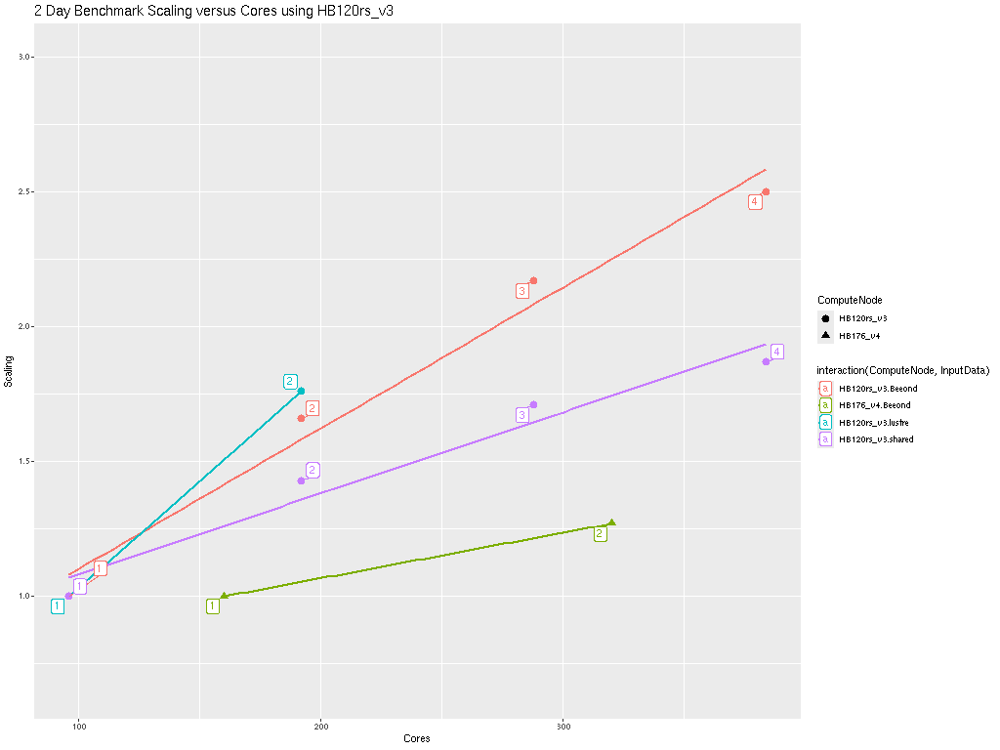
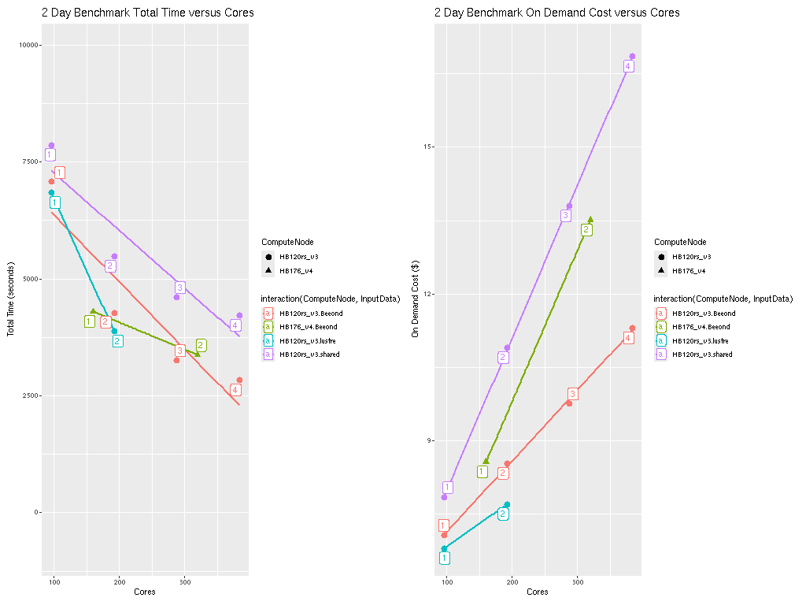
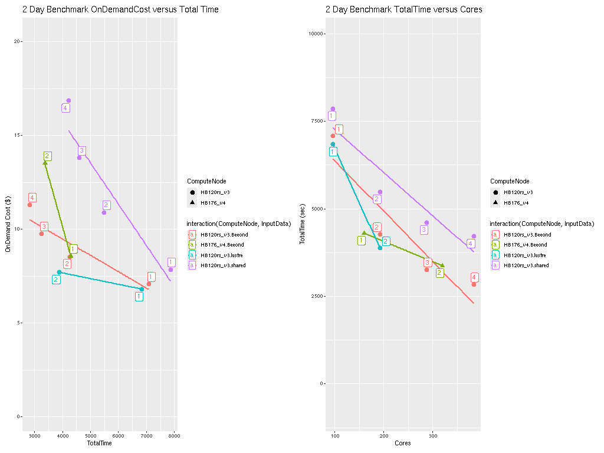

Performance Optimization for Cycle Cloud

## Right-sizing Compute Nodes for the CycleCloud

Selection of the compute nodes depends on the domain size and resolution for the CMAQ case, the CMAQ Version, the model run time requirements, and the disks (beeond, lustre, or shared) used for input and output.
Larger hardware and memory configurations may also be required for instrumented versions of CMAQ incuding CMAQ-ISAM and CMAQ-DDM3D.
The CycleCloud allows you to run the compute nodes only as long as the job requires, and you can also update the compute nodes as needed for your domain.

## An explanation of why a scaling analysis is required for Multinode or Parallel MPI Codes

Quote from the following link.

"IMPORTANT: The optimal value of --nodes and --ntasks for a parallel code must be determined empirically by conducting a scaling analysis. As these quantities increase, the parallel efficiency tends to decrease. The parallel efficiency is the serial execution time divided by the product of the parallel execution time and the number of tasks. If multiple nodes are used then in most cases one should try to use all of the Cores on each node."

```{note}
For the scaling analysis that was performed with CMAQ, the parallel efficiency was determined as the runtime for the smallest number of Cores divided by the product of the parallel execution time and the number of additional cpus used. If smallest NPCOLxNPROW configuration was 18 cpus, the run time for that case was used, and then the parallel efficiency for the case where 36 cpus were used would be parallel efficiency = runtime_18cpu/(runtime_36cpu*2)*100
```

```{seealso}
<a href="https://researchcomputing.princeton.edu/support/knowledge-base/scaling-analysis">Scaling Analysis - see section on Multinode or Parallel MPI Codes</a>

<a href="https://researchcomputing.princeton.edu/support/knowledge-base/slurm#multinode">Example Slurm script for Multinode Runs</a>
```

## Slurm Compute Node Provisioning

Azure CycleCloud relies on SLURM to make the job allocation and scaling decisions. The jobs are launched, terminated, and resources maintained according to the Slurm instructions in the CMAQ run script. The CycleCloud Web Interface is used to set the identity of the head node and the compute node, and the maximum number of compute nodes that can be submitted to the queue. 

Number of compute nodes dispatched by the slurm scheduler is specified in the run script using #SBATCH --nodes=XX #SBATCH --ntasks-per-node=YY where the maximum value of tasks per node or YY limited by many Cores are on the compute node.

As an example:

For HB120rs_v3, there are 120 Cores/node, so maximum value of YY is 120 or --ntask-per-node=120
For many of the runs that were done, we set --ntask-per-node=96 so that we could compare to the Parallel Cluster, and to avoid oversubscribing the cores.

If running a job with 192 processors, this would require the --nodes=XX or XX to be set to 2 compute nodes, as 96x2=192.

The setting for NPCOLxNPROW must also be a maximum of 192, ie. 16 x 12 or 12 x 16 to use all of the Cores in the Cycle Cloud HPC Node.

If running a job with 240 processors, this would require the --nodes=XX or XX to be set to 2 compute nodes, as 120x2=240.

<a href="https://azure.com/e/a5d6f8654d634e8b93973574cbda428d">Azure HBv3-120 Pricing</a>


Table 1. Azure Instance On-Demand versus Spot Pricing (price is subject to change)

| Instance Name	| Cores |  RAM      |  Memory Bandwidth	| Network Bandwidth | Linux On-Demand Price | Linux Spot Price | 
| ------------  | ----- | --------  | ---------------   | ---------------   | --------------------  | ---------------  |
| HB120rs_v3	| 120	|  448 GiB   |	 350 Gbps	    | 200 Gbps(Infiniband)  |   $3.6/hour         | $.36     |
| HB176_v4      | 176   |   656 GiB  |   780 Gbps       | 400 Gbps(Infiiniband) |  $7.2/hour          | $.41     |

<a href="https://learn.microsoft.com/en-us/azure/virtual-machines/hbv3-series">Azure HBv3-series Specifications</a>
<a href="https://learn.microsoft.com/en-us/azure/virtual-machines/hbv4-series">Azure HBv4-series Specifications</a>

Note, check to see what processors were used 

```
lscpu
```

Core (logs in March 2023)

```
Vendor ID:           AuthenticAMD
CPU family:          25
Model:               1
Model name:          AMD EPYC 7763 64-Core Processor
Stepping:            1
CPU MHz:             3021.872
BogoMIPS:            4890.85
Virtualization:      AMD-V
Hypervisor vendor:   Microsoft
Virtualization type: full
L1d cache:           32K
L1i cache:           32K
L2 cache:            512K
L3 cache:            32768K
NUMA node0 CPU(s):   0-3
```

Table 2. Timing Results for CMAQv5.4+ 2 Day 12US1 (CONUS) Run on Cycle Cloud with D12v2 schedulare node and HBv3-120 Compute Nodes (120 cpu per node), I/O on /mnt/beeond

| Cores | Nodes | NodesxCores | COLROW | Day1 Timing (sec) | Day2 Timing (sec) | TotalTime | VM Hours/day | SBATCHexclusive |   Equation using Spot Pricing | SpotCost | Equation using On Demand Pricing | OnDemandCost | compiler flag | InputData | cpuMhz |
| -----| ---- | -----------    | -----------   | ----------------     | ---------------      | ------------------- |  ------------------ |  ---------        |   -------- | --------- | ---------------      | -- | -- | -- | -- |
| 96   | 1 |  1x96     |    8x12            |   3278.9            |  3800.7             |   7079.60   | .983 |  no | $.36/hr * 1 nodes * 1.966 hr = | .708   |  $3.6/hr * 1 nodes * 1.966 hr = |  7.077 |  without -march=native compiler flag | Beeond | 3021.872 |
| 192  | 2 |   2x96    |    16x12           | 2027.8              |  2241.6             |   4269.40   | .593 |  no | $.36/hr * 2 nodes * 1.186 hr = | .854   | $3.6/hr * 2 nodes * 1.186 hr = | 8.54 | without -march=native compiler flag | Beeond | 3021.872 | 
| 288  | 3 |   3x96          | 16x18         | 1562.7              | 1692.6              |   3255.30  | .452 |  no | $.36/hr * 3 nodes * .904 hr = | .976 | $3.6/hr * 3 nodes * .904 hr = |  9.76 | without -march=native compiler flag | Beeond | 3021.872 | 
| 384  | 4 |   4x96          | 16x24         | 1356.5              |  1474.2            |  2830.70    | .393 | no  | $.36/hr * 4 nodes * .786 hr = | 1.13 | $3.6/hr * 4 nodes * .786 hr = | 11.3  | without -march=native compiler flag |  Beeond | 3021.872 |

Total HBv3-120 compute cost of Running Benchmarking Suite using SPOT pricing = .36/hr

Total HBv3-120 compute cost of Running Benchmarking Suite using ONDEMAND pricing = $3.6/hr

For CentosOS or Ubuntu Linux in East US Region.

Savings is ~ 90% for spot versus  ondemand pricing for HBv3-120 compute nodes.

<a href="https://azure.microsoft.com/en-us/pricing/details/virtual-machines/linux/">Azure Spot and On-Demand Pricing</a>
<a href="https://azure.microsoft.com/en-us/pricing/spot-advisor/">Azure Spot and On-Demand Pricing</a>

Table 3. Timing Results for CMAQv5.4+ 2 Day 12US1 (CONUS) Run on Cycle Cloud with D12v2 schedulare node and HBv2-120 Compute Nodes (120 cores per node), I/O on /mnt/beeond

| Cores | Nodes | NodesxCore | COLROW | Day1 Timing (sec) | Day2 Timing (sec) | TotalTime | VM Hours/day | SBATCHexclusive |  Equation using Spot Pricing | SpotCost | Equation using On Demand Pricing | OnDemandCost | compiler flag | InputData | Pin |
| ---- | ----  | -----------   | ----------------     | ---------------      | ----------- | -----      | --------------          | ---------                              | --------- | ------ | ---------------      | --- | ---- | ---- | --- |
| 96  | 1   |   1x96   |    12x8        | 3400.95       | 3437.91  |   6838.86  | .950  |  no  |     $1.89/hr * 1 nodes * $.36 = | $.68 | 1.89/hr * 1 nodes * 3.6 = | 6.804   | no | Beeond | no |
| 192 | 2   |   2x96   |    16x12       | 1954.62       | 1920.57  |   3875.19  | .538  | no     |   $1.07/hr * 2 nodes * $.36 =  | $.77 | 1.07/hr * 2 nodes * 3.6 = | 7.704   | no | Beeond | no |


Table 4. Timing Results for CMAQv5.4+ 2 Day 12US1 (CONUS) Run on Cycle Cloud with D12v2 schedulare node and HB176_v3 Compute Nodes (176 cores per node), I/O using Beeond
| Cores | Nodes | NodesxCore | COLROW | Day1 Timing (sec) | Day2 Timing (sec) | TotalTime | VM Hours/day | SBATCHexclusive |  Equation using Spot Pricing | SpotCost | Equation using On Demand Pricing | OnDemandCost | compiler flag | InputData | Pin |
| ---- | ----  | -----------   | ----------------     | ---------------      | ----------- | -----      | --------------          | ---------                              | --------- | ------ | ---------------      | --- | ---- | ---- | --- |
| 160  | 1   |   1x176   |    16x10        | 2062.9       | 2235.3  |   4298.2  | 0.597  |  no  |     $1.19/hr * 1 nodes * $.41 = | $.4879 | 1.19/hr * 1 nodes * 7.2 = | 8.568   | no | beeond | no |
| 320  | 2   |   2x176   |    16x20        | 1644.4       | 1728.3  |   3372.7  | 0.468  |  no  |     $.938/hr * 1 nodes * $.41 = | $.769 | .938/hr * 2 nodes * 7.2 = | 13.51   | no | beeond | no |


# Benchmark Scaling Plots using CycleCloud

Note: the numbers on the plot surrounded by a box indicates the number of Compute Nodes or Virtual Machines.

Figure 1. Plot of Scaling per Core 




Figure 2. Plot of Total Time and On Demand Cost versus Cores for HB120_v3 and HB176_v4



Figure 3. Plot of On Demand Cost versus Total Time for HB120_v3 and HB176_v4



Note CMAQ scales well up to ~ 288 Cores for the CONUS domain.  As more cores are added beyond 288 cores, the CMAQ gets less efficient at using all of them.

Scheduler node D12v2 compute cost = Will be charged for the scheduler for the entire time that the CycleCloud HPC Cluster is running ( creation to deletion) = 6 hours * $0.?/hr = $ ? using spot pricing, 6 hours * $?/hr = $? using on demand pricing.

## Annual Run Estimates

Using 288 cpus on the Cycle Cloud Cluster, it would take 1 week to run a full year, using 3 HBv3-120 compute nodes, at a cost of $1782 using ondemand nodes, or $178.2 using interruptable spot nodes.
(Note, spot nodes have not been tried yet in this tutorial.)


Table 5. Extrapolated Cost for CMAQv5.4 Annual Simulation based on 2 day 12US1 CONUS benchmark, without pinning

| Virtual Machine |  Nodes | Cores | SPOT $/hr | OnDemand $/hr | 2 day time seconds | 2 day time hours | Annual Cost Equation | Total Core hours | Annual Cost Spot | Annual Cost OnDemand | Days to Complete Annual Simulation |  
| --------  | -- | --  | ----- |  ---- |  ------ | ------ | --------------------------------------------------- |  ---- | ----- | ----- | ----    |
|  HB120_v3 |  1 |  96 |  $.36 |  $3.6 | 7079.60 |  1.96  | 1.96/2 * 365 = 359 hours/node * 1 node              | 359   | $129  | $1292 | 14.9 |
|  HB120_v3 | 2  | 192 |  $.36  | $3.6 | 4269.40 |  1.19  | 1.19/2 * 365 = 216 hours/node * 2 nodes             | 432   |  $155.8 | $1558 |  9 |
|  HB120_v3 | 3  | 288 |  $.36  | $3.6 | 3255.3  | .904 |.904/2 * 365 = 165 hours/node * 3 nodes                | 495   |  $178.2 | $1782 | 6.8 |
|  HB120_v3 | 4  | 384 |  $.36 | $3.6  |  2830.70 | .786 | .786/2 * 365 = 143.5 hours/node * 4 nodes            | 574  |  $206.7 | $2066 | 5.95 |
|  HB176_v4 | 1  | 160 |  $.41  | $7.2 | 4298.2   |  1.19 | 1.19/2 * 365 = 217.9 hours/node * 1 node            | 218  | $89.3 | $1569 | 9.04` | 
|  HB176_v4 | 2  | 320 |  $.41  | $7.2 | 3372.7 | 0.94 | .94/2 * 365 = 171.55 hours/node * 2 node               |  343 | $140.7 | $2470.3 | 7.2 |


<a href="https://docs.microsoft.com/en-us/azure/virtual-machines/disks-shared">Azure SSD Disk Pricing</a>
<a href="https://azure.microsoft.com/en-us/pricing/details/managed-disks/">Azure SSD Disk Pricing</a>


Table 6. Shared SSD File System Pricing

| Storage Type | Storage throughput   | 	Max IOPS (Max IOPS w/ bursting)	| Pricing (monthly)  |  Pricing | Price per mount per month (Shared Disk) |
| --------     | ----------------  |   ------------------------------------    | -----------------  |  ---------------  | ------  |
| Persistant 1TB  | 200 MB/s/TB       | 	5,000 (30,000)                                  |	$122.88/month |  $6.57                 |

## Lustre File System Pricing

Table 7. Lustre File System Pricing
*note, there isn't currently a method that starts and stops the Lustre Filesystem as part of the CycleCloud start and stop, so there is a danger of leaving the lustre file system on for long periods of time. It is recommended that you use the Beeond Filesystem, where we get similar performance, but at zero cost.


|  Storage Type | Storage throughput | Storage Capacity Availability (in multiples of) | Cost per GiB/hr  |Cost/month for minimum capacity available |
| -----------   | ----------------   | --------------------------------                |    -------------- |  ------------                 |
| Standard tier |  125 MB/s          |  16,000 GiB                                     | .000198           | $2312  |
| Premium tier  |  250 MB/s          |  8,000  GiB                                     | .000287           | $1676  |
| Ultra tier    |  500 MB/s          |  4,000  GiB                                     | .000466           | $1361  |

According to the Azure calculators, the price varies by I/O Speed, and different tiers have different minimum storage size requirements.:

Calculations: <br>
16000 GiB (17 TB) x 730 Hours x 0.000198Per GiB/hour = $2312 / month <br>
8000 GiB (9 TB)  x 730 Hours x $0.000287 Per GiB/hour = $1676 / month <br>
4000 GiB (4.3 TB) x 730 Hours x 0.000466Per GiB/hour = $1361 / month <br>


Table 7. Extrapolated Cost of File system for CMAQv5.4 Annual Simulation based on 2 day CONUS benchmark


Need to create table


Also need estimate for Archive Storage cost for storing an annual simulation


### Recommended Workflow

Post-process monthly save output and/or post-processed outputs to archive storage at the end of each month.

Goal is to develop a reproducable workflow that does the post processing after every month, and then copies what is required to archive storage, so that only 1 month of output is stored at a time on the /shared/data scratch file system.
This workflow will help with preserving the data in case the cluster or scratch file system gets pre-empted.

