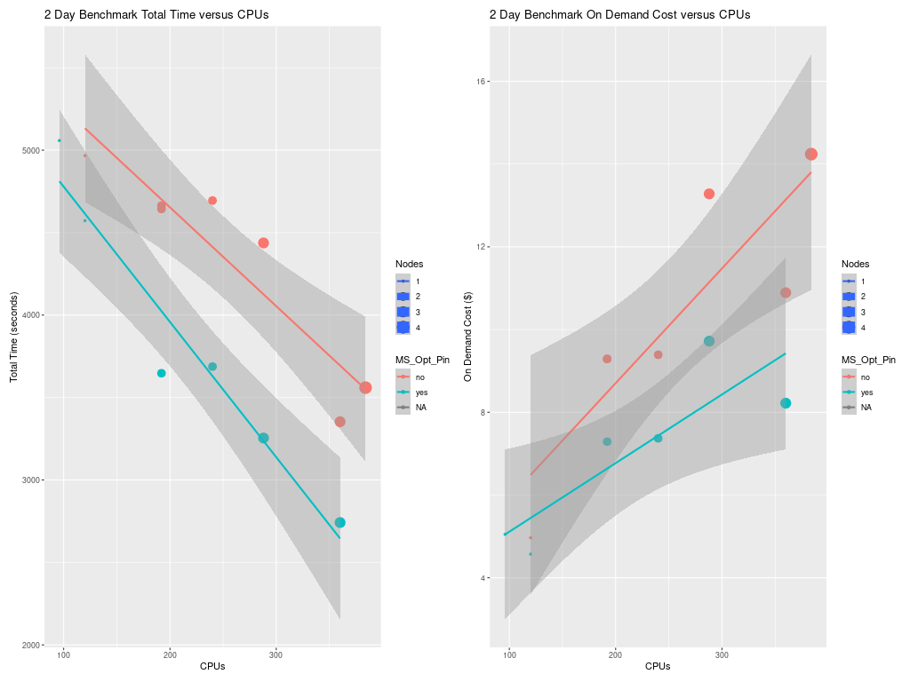
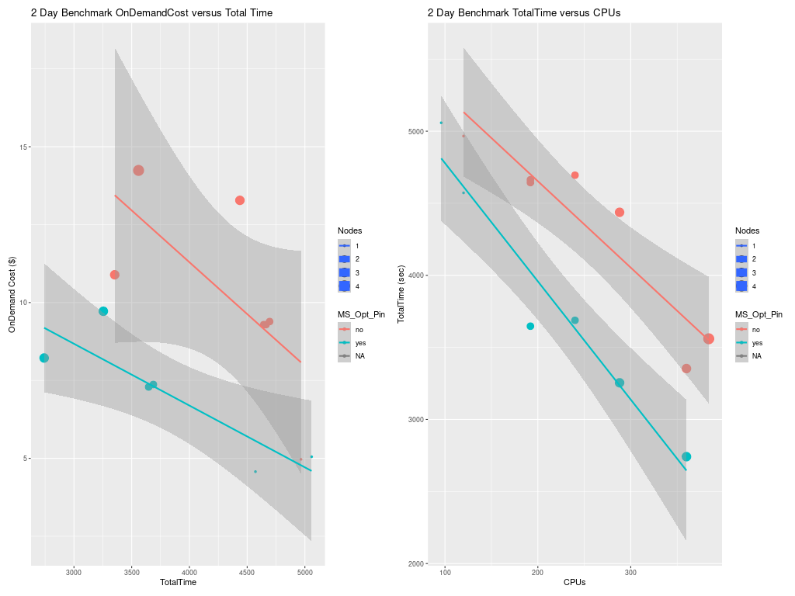

Performance Optimization for Cycle Cloud

## Right-sizing Compute Nodes for the CycleCloud

Selection of the compute nodes depends on the domain size and resolution for the CMAQ case, and what your model run time requirements are.
Larger hardware and memory configurations may also be required for instrumented versions of CMAQ incuding CMAQ-ISAM and CMAQ-DDM3D.
The CycleCloud allows you to run the compute nodes only as long as the job requires, and you can also update the compute nodes as needed for your domain.

## An explanation of why a scaling analysis is required for Multinode or Parallel MPI Codes

Quote from the following link.

"IMPORTANT: The optimal value of --nodes and --ntasks for a parallel code must be determined empirically by conducting a scaling analysis. As these quantities increase, the parallel efficiency tends to decrease. The parallel efficiency is the serial execution time divided by the product of the parallel execution time and the number of tasks. If multiple nodes are used then in most cases one should try to use all of the CPU-cores on each node."

```{note}
For the scaling analysis that was performed with CMAQ, the parallel efficiency was determined as the runtime for the smallest number of CPUs divided by the product of the parallel execution time and the number of additional cpus used. If smallest NPCOLxNPROW configuration was 18 cpus, the run time for that case was used, and then the parallel efficiency for the case where 36 cpus were used would be parallel efficiency = runtime_18cpu/(runtime_36cpu*2)*100
```

```{seealso}
<a href="https://researchcomputing.princeton.edu/support/knowledge-base/scaling-analysis">Scaling Analysis - see section on Multinode or Parallel MPI Codes</a>

<a href="https://researchcomputing.princeton.edu/support/knowledge-base/slurm#multinode">Example Slurm script for Multinode Runs</a>
```

## Slurm Compute Node Provisioning

Azure CycleCloud relies on SLURM to make the job allocation and scaling decisions. The jobs are launched, terminated, and resources maintained according to the Slurm instructions in the CMAQ run script. The CycleCloud Web Interface is used to set the identity of the head node and the compute node, and the maximum number of compute nodes that can be submitted to the queue. 

Number of compute nodes dispatched by the slurm scheduler is specified in the run script using #SBATCH --nodes=XX #SBATCH --ntasks-per-node=YY where the maximum value of tasks per node or YY limited by many CPUs are on the compute node.

As an example:

For HB120rs_v3, there are 120 CPUs/node, so maximum value of YY is 120 or --ntask-per-node=120
For many of the runs that were done, we set --ntask-per-node=36 so that we could compare to the Parallel Cluster

If running a job with 192 processors, this would require the --nodes=XX or XX to be set to 2 compute nodes, as 96x2=192.

The setting for NPCOLxNPROW must also be a maximum of 192, ie. 16 x 12 or 12 x 16 to use all of the CPUs in the Cycle Cloud HPC Node.

If running a job with 240 processors, this would require the --nodes=XX or XX to be set to 2 compute nodes, as 120x2=240.

<a href="https://azure.com/e/a5d6f8654d634e8b93973574cbda428d">Azure HBv3-120 Pricing</a>


Table 1. Azure Instance On-Demand versus Spot Pricing (price is subject to change)

| Instance Name	| CPUs |  RAM      |  Memory Bandwidth	| Network Bandwidth | Linux On-Demand Price | Linux Spot Price | 
| ------------  | ----- | --------  | ---------------   | ---------------   | --------------------  | ---------------  |
| HBv3-120	| 120	|  448 GiB   |	 350 Gbps	        | 200 Gbps(Infiniband)          |   $3.6/hour         | $1.4/hour     |


Table 2. Timing Results for CMAQv5.4+ 2 Day 12US1 (CONUS) Run on Cycle Cloud with D12v2 schedulare node and HB-120rs_v3 Compute Nodes (120 cpu per node) I/O on /shared directory

Note, check to see what CPUs were used 

```
lscpu
```

CPU (logs in March 2023)

```
Vendor ID:           AuthenticAMD
CPU family:          25
Model:               1
Model name:          AMD EPYC 7763 64-Core Processor
Stepping:            1
CPU MHz:             3021.872
BogoMIPS:            4890.85
Virtualization:      AMD-V
Hypervisor vendor:   Microsoft
Virtualization type: full
L1d cache:           32K
L1i cache:           32K
L2 cache:            512K
L3 cache:            32768K
NUMA node0 CPU(s):   0-3
```


| CPUs | Nodes | NodesxCPU | COLROW | Day1 Timing (sec) | Day2 Timing (sec) | TotalTime | CPU Hours/day | SBATCHexclusive |   Equation using Spot Pricing | SpotCost | Equation using On Demand Pricing | OnDemandCost | compiler flag | InputData | cpuMhz |
| -----| ---- | -----------    | -----------   | ----------------     | ---------------      | ------------------- |  ------------------ |  ---------        |   -------- | --------- | ---------------      | -- | -- | -- | -- |
| 96   | 1 |  1x96     |    8x12            |   3278.9            |  3800.7             |   7079.60   | .983 |  no | $1.4/hr * 1 nodes * 1.966 hr = | $2.75             |  $3.6/hr * 1 nodes * 1.966 hr = |  7.077           |  without -march=native compiler flag | Beeond | 3021.872 |
| 192  | 2 |   2x96    |    16x12           | 2027.8              |  2241.6             |   4269.40   | .593 |  no | $1.4/hr * 2 nodes * 1.186 hr = | $3.32           | $3.6/hr * 2 nodes * 1.186 hr = | 8.54                     | without -march=native compiler flag | Beeond | 3021.872 | 
| 288  | 3 |   3x96          | 16x18         | 1562.7              | 1692.6              |   3255.30  | .452 |  no | $1.4/hr * 3 nodes * .904 hr = | $3.79 | $3.6/hr * 3 nodes * .904 hr = |  9.76 | without -march=native compiler flag | Beeond | 3021.872 | 

Total HBv3-120 compute cost of Running Benchmarking Suite using SPOT pricing = $1.4/hr

Total HBv3-120 compute cost of Running Benchmarking Suite using ONDEMAND pricing = $3.6/hr

Savings is ~ 60% for spot versus  ondemand pricing for HBv3-120 compute nodes.

<a href="https://azure.microsoft.com/en-us/pricing/details/virtual-machines/linux/">Azure Spot and On-Demand Pricing</a>

Table 4. Timing Results for CMAQv5.4+ 2 Day 12US1 (CONUS) Run on Cycle Cloud with D12v2 schedulare node and HBv3-120 Compute Nodes (120 cpu per node), I/O on /lustre 

| CPUs | Nodes | NodesxCPU | COLROW | Day1 Timing (sec) | Day2 Timing (sec) | TotalTime | CPU Hours/day | SBATCHexclusive |  Equation using Spot Pricing | SpotCost | Equation using On Demand Pricing | OnDemandCost | compiler flag | InputData | Pin |
| ---- | ----  | -----------   | ----------------     | ---------------      | ----------- | -----      | --------------          | ---------                              | --------- | ------ | ---------------      | --- | ---- | ---- | --- |
| 96  | 1   |   1x96   |    12x8        | 3053.34       | 2753.47  |   5806.81  | 1.61  |  no  |     $.8065/hr * 1 nodes * $? = | $? | .8065/hr * 1 nodes * 3.6 = | 2.90   | no | shared | yes |
| 576 | 6   |   6x96   |    24x24       | 950.89     | 863.18 | 1814.07   | .504  | no     |   $.252/hr * 6 nodes * $? =  | $? | .252/hr * 6 nodes * 3.6 = | 5.44   | no | lustre | yes |


# Benchmark Scaling Plots using CycleCloud

## Benchmark Scaling Plot for CycleCloud using HC44rs Compute Nodes

Figure 4. Scaling per Node on HB120rs_v3 Compute Nodes (120 cpu/node)


Figure 7. Scaling per CPU on HBv120 Compute Node (120 cpu/node)


Figure 8 shows the scaling per-node, as the configurations that were run were multiples of the number of cpus per node.  CMAQ was not run on a single cpu, as this would have been costly and inefficient.


Figure 10. Plot of Total Time and On Demand Cost versus CPUs for HBv120



Figure 11. Plot of On Demand Cost versus Total Time for HBv120


Figure 11. Scaling Plot Comparison of Parallel Cluster and Cycle Cloud


Note CMAQ scales well up to ~ 288 processors for the CONUS domain.  As more processors are added beyond 288 processors, the CMAQ gets less efficient at using all of them.
The Cycle Cloud HC44RS performance is similar to the c5n.18xlarge using 36 cpus/node on 8 nodes, or 288 cpus.
cost is $39.54 for Cycle Cloud compared to $19.46  for Parallel Cluster for the 2-Day 12US2 CONUS Benchmark.

Figure 12. Plot of Total Time and On Demand Cost versus CPUs for HC44RS.


Figures: todo - need screenshots of Azure Pricing

Fost by Instance Type - update for Azure 


Figure 13. Cost by Usage Type - Azure Console


Figure 14. Cost by Service Type - Azure Console


Scheduler node D12v2 compute cost = entire time that the CycleCloud HPC Cluster is running ( creation to deletion) = 6 hours * $0.?/hr = $ ? using spot pricing, 6 hours * $?/hr = $? using on demand pricing.


Using 360 cpus on the Cycle Cloud Cluster, it would take ~6.11 days to run a full year, using 3 HBv3-120 compute nodes.

Table 6. Extrapolated Cost of HBv3-120 used for CMAQv5.4 Annual Simulation based on 2 day CONUS2 benchmark

| Benchmark Case | Number of PES | Compute Nodes | Number of HBv3-120 Nodes | Pinning | Pricing    |   Cost per node | Time to completion (hour)   | Extrapolate Cost for Annual Simulation  | Annual Cost | Days to Complete Annual Simulation |  
| -------------  | ------------  |  -------      | --------------- | -------    |  -------------- | ------------------          |  --------------------------------------------------    | --- | ---- | --- |
| 2 day CONUS    |   96          |  HBv3-120  |        1       |    SPOT    | Yes |    1.4/hour   | 3800.7/3600 = 1.06   |    1.06/2 * 365 = 193.4 hours/node * 1 node = 193.4 * $1.4 = | $271 | 8.06 |
| 2 day CONUS    |   96          |  HBv3-120  |        1       |  ONDEMAND  | Yes |    3.6/hour   | 3800.7/3600 = 1.06   |    1.06/2 * 365 = 193.4 hours/node * 1 node = 193.4 * $3.6 = | $696 | 8.06 | 
| 2 day CONUS    |  192          |  HBv3-120  |        2       |    SPOT    | Yes |    1.4/hour   | 2241.6/3600 = .623   |    .623/2 * 365 = 115.3 hours/node * 2 nodes = 230.7 * $1.4 = |  $322 | 4.80 |
| 2 day CONUS    |  192          |  HBv3-120  |        2       |  ONDEMAND  | Yes |    3.6/hour   | 2241.6/3600 = .623   |    .623/2 * 365 = 115.3 hours/node * 2 nodes = 230.7 * $3.6 = |  $830.52 | 4.80 | 
| 2 day CONUS    |  288          |  HBv3-120  |        3       |    SPOT    | No |   .3168/hour |   1692.6/3600 = .47  |    .47/2 * 365 = 85.8 hours/node * 3 nodes = 257.3 * $1.4  = |  $360 | 3.6 |
| 2 day CONUS    |  288          |  HBv3-120  |        3       |  ONDEMAND  | No |   3.168/hour   | 1692.6/3600 = .47  |    .47/2 * 365 = 85.8 hours/node * 3 nodes = 257.3 * $3.6 = | $925 | 3.6 |


<a href="https://docs.microsoft.com/en-us/azure/virtual-machines/disks-shared">Azure SSD Disk Pricing</a>
<a href="https://azure.microsoft.com/en-us/pricing/details/managed-disks/">Azure SSD Disk Pricing</a>


Table 7. Shared SSD File System Pricing

| Storage Type | Storage options   | 	Max IOPS (Max IOPS w/ bursting)	| Pricing (monthly)  |  Pricing | Price per mount per month (Shared Disk) |
| --------     | ----------------  |   ------------------------------------    | -----------------  |  ---------------  | ------  |
| Persistant 1TB  | 200 MB/s/TB       | 	5,000 (30,000)                                  |	$122.88/month |  $6.57                 |


Table 8. Extrapolated Cost of File system for CMAQv5.4 Annual Simulation based on 2 day CONUS benchmark


Need to create table


Also need estimate for Archive Storage cost for storing an annual simulation


### Recommended Workflow

Post-process monthly save output and/or post-processed outputs to archive storage at the end of each month.

Goal is to develop a reproducable workflow that does the post processing after every month, and then copies what is required to archive storage, so that only 1 month of output is stored at a time on the /shared/data scratch file system.
This workflow will help with preserving the data in case the cluster or scratch file system gets pre-empted.

