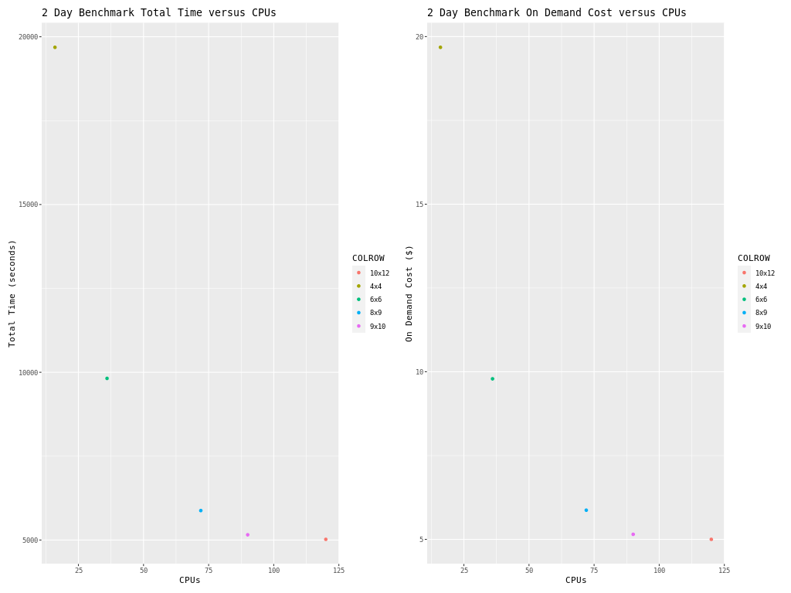

Performance Optimization for Single Virtual Machine

## Right-sizing Compute Nodes for a Single Virtual Machine.

Selection of the compute nodes depends on the domain size and resolution for the CMAQ case, and what your model run time requirements are.
Larger hardware and memory configurations may also be required for instrumented versions of CMAQ incuding CMAQ-ISAM and CMAQ-DDM3D.
Running on a single virtual machine requires that the user know how CMAQ scales for the domain of interest.

## An explanation of why a scaling analysis is required for Multinode or Parallel MPI Codes

Quote from the following link.

"IMPORTANT: The optimal value of --nodes and --ntasks for a parallel code must be determined empirically by conducting a scaling analysis. As these quantities increase, the parallel efficiency tends to decrease. The parallel efficiency is the serial execution time divided by the product of the parallel execution time and the number of tasks. If multiple nodes are used then in most cases one should try to use all of the CPU-cores on each node."

```{note}
For the scaling analysis that was performed with CMAQ, the parallel efficiency was determined as the runtime for the smallest number of CPUs divided by the product of the parallel execution time and the number of additional cpus used. If smallest NPCOLxNPROW configuration was 18 cpus, the run time for that case was used, and then the parallel efficiency for the case where 36 cpus were used would be parallel efficiency = runtime_18cpu/(runtime_36cpu*2)*100
```

```{seealso}
<a href="https://researchcomputing.princeton.edu/support/knowledge-base/scaling-analysis">Scaling Analysis - see section on Multinode or Parallel MPI Codes</a>

```

<a href="https://azure.com/e/a5d6f8654d634e8b93973574cbda428d">Azure HBv3-120 Pricing</a>


Table 1. Azure Instance On-Demand versus Spot Pricing (price is subject to change)

| Instance Name	| CPUs |  RAM      |  Memory Bandwidth	| Network Bandwidth | Linux On-Demand Price | Linux Spot Price | 
| ------------  | ----- | --------  | ---------------   | ---------------   | --------------------  | ---------------  |
| HBv3-120	| 120	|  448 GiB   |	 350 Gbps	        | 200 Gbps(Infiniband)          |   $3.6/hour         | $1.4/hour     |


Table 2. Timing Results for CMAQv5.3.3 2 Day CONUS2 Run on Single Virtual Machine HBv120 (120 cpu per node) I/O on /shared directory

|CPUs |   NodesbyCPU |  NPCOLxNPROW  |   Day1 Timing (sec)  |  Day2 Timing (sec) |  TotalTime  | CPU Hours/day |  SBATCH --exclusive | Data Imported or Copied  |   Answers Matched  |  Equation using Spot Pricing |  SpotCost  |    Equation using On Demand Pricing |  OnDemandCost |   compiler flag |  i/o dir |
| --  | ----------   | -----------   |  -----------------   |  ----------------  |  ---------  | ------------  |  -----------------  |  ----------------------  |   --------------   |  --------------------------  |  -------   |   -------------------------         |  --------     |   ------------  | -------  |
|16   |   1x16  |  4x4  |   10374.66 |       9310.67  |       19685.33 |       2.734 |  no  |    copied |  yes |    $1.44/hr * 1 nodes * 5.468 = |   7.87 |   3.6/hr * 1 nodes * 5.468 = |     19.68 |  with -march=native compiler flag |       shared/data |
|36   |   1x36  |  6x6  |   5102.89  |       4714.96  |       9817.85  |       1.36  |  no  |    copied | yes  |   $1.44/hr * 1 nodes * 2.72 =   |  3.92  |  3.6/hr * 1 nodes * 2.72  =  |    9.79   | with -march=native compiler flag  |      /shared/data |
|72   |   1x72  |  8x9  |   3130.73  |       2747.3   |       5878.03  |       .815  |  no  |    copied | yes  |   $1.44/hr * 1 nodes * 1.63 =   |  2.35  |  3.6/hr * 1 nodes * 1.63  =  |    5.87   | with -march=native compiler flag  |      /shared/data | 
|90   |   1x90  |  9x10 |   2739.38  |       2417.26  |       5156.64  |       .715  |  no  |    copied | yes  |   $1.44/hr * 1 nodes * 1.43 =   |  2.06  |  3.6/hr * 1 nodes * 1.43 =   |    5.15   | with -march=native compiler flag  |      /shared/data |
|120  |   1x120 |  10x12 |   2646.52 |        2374.21 |        5020.73 |        .6973 |   no |   copied |  yes |    $1.44/hr * 1 nodes * 1.3946 = |  2.01 |    3.6/hr * 1 nodes * 1.39 = |      5.00 |   with -march=native compiler flag |        /shared/data |


Total HBv3-120 compute cost of Running Benchmarking Suite using SPOT pricing = $1.4/hr

Total HBv3-120 compute cost of Running Benchmarking Suite using ONDEMAND pricing = $3.6/hr

Savings is ~ 60% for spot versus  ondemand pricing for HBv3-120 compute nodes.

<a href="https://azure.microsoft.com/en-us/pricing/details/virtual-machines/linux/">Azure Spot and On-Demand Pricing</a>

# Benchmark Scaling Plots using Single Virtual Machine HBv120


Figure 1. Plot of Time and On Demand Cost versus CPU


