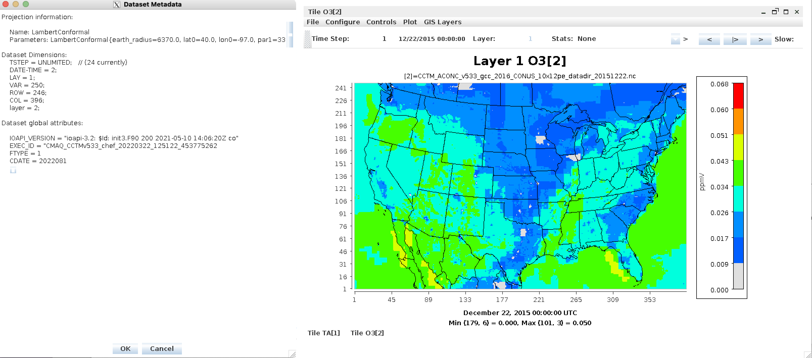
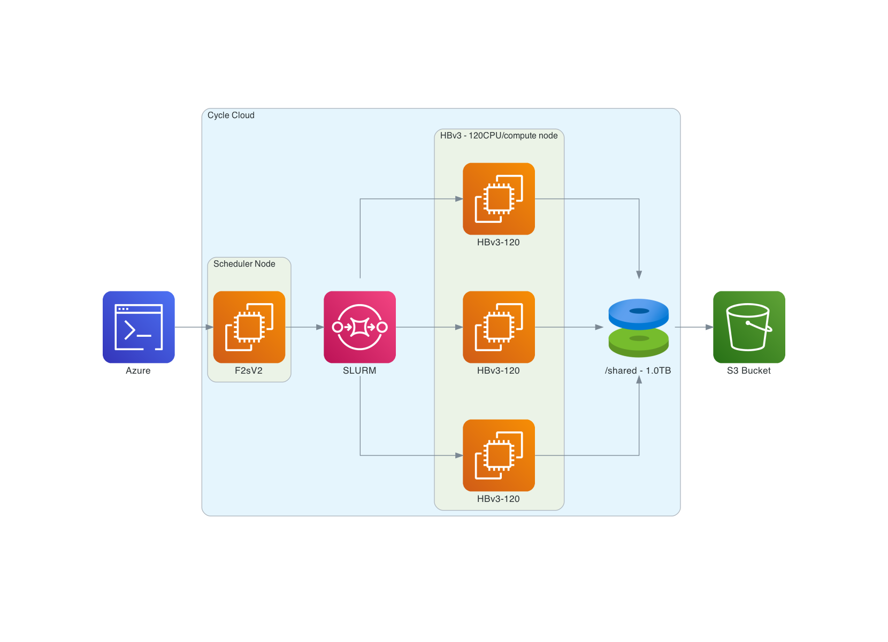

## System Requirements for Cycle Cloud

### Please set up a alarm on Azure 
Set alarm to receive an email alert if you exceed $100 per month (or what ever monthly spending limit you need).
It may be possible to set up daily or weekly spending alarms as well.

### Software Requirements for CMAQ on CycleCloud

Tier 1: Native OS and associated system libraries, compilers

* Tcsh shell
* Centos7  (tried ubuntu but the module command did not provide updated compilers and openmpi)
* Git
* Compilers (C, C++, and Fortran) - GNU compilers version ≥ gcc (GCC) 4.8.5 20150623 (Red Hat 4.8.5-44)
* MPI (Message Passing Interface) -  OpenMPI ≥ 4.1.0
* NetCDF (with C, C++, and Fortran support)
* I/O API
* Slurm Scheduler

Tier 2: additional libraries required for installing CMAQ

* NetCDF (with C, C++, and Fortran support)
* I/O API

Tier 3: Software distributed thru the CMAS Center

* CMAQv533
* CMAQv533 Post Processors

Tier 4: R packages and Scripts

* R QA Scripts

### Hardware Requirements

#### Recommended Minimum Requirements

The size of hardware depends on the domain size and resolution for  your CMAQ case, and how quickly your turn-around requirements are.
Larger hardware and memory configurations are also required for instrumented versions of CMAQ incuding CMAQ-ISAM and CMAQ-DDM3D.


### Azure CycleCloud

Azure CycleCloud Provides the simplest way to manage HPC workloads using any scheduler (like Slurm, Grid Engine, HPC Pack, HTCondor, LSF, PBS Pro, or Symphony), on Azure

CycleCloud allows you to:

* Deploy full clusters and other resources, including scheduler, compute VMs, storage, networking, and cache
* Orchestrate job, data, and cloud workflows
* Give admins full control over which users can run jobs, as well as where and at what cost
* Customize and optimize clusters through advanced policy and governance features, including cost controls, Active Directory integration, monitoring, and reporting
* Use your current job scheduler and applications without modification
* Take advantage of built-in autoscaling and battle-tested reference architectures for a wide range of HPC workloads and industries


<a href="https://docs.microsoft.com/en-us/azure/architecture/topics/high-performance-computing#azure-cyclecloud">High Performance Computing on Azure CycleCloud</a>

<a href="https://docs.microsoft.com/en-us/azure/cyclecloud/?view=cyclecloud-8">Azure CycleCloud</a>

### Ensure your vCPU quota has been increased before attempting to run large-scale workloads.

<a href="https://docs.microsoft.com/en-us/azure/virtual-machines/linux/quotas">Azure VM Quotas</a>

#### 12US2 Benchmark Domain Description

```
GRIDDESC
'12US2'
'12CONUS'     -2412000.0 -1620000.0 12000.0 12000.0 396 246 1
```




#### Recommended Cycle Cloud Configuration for CONUS Domain 12US2

Note, first create a VM using the image: CycleCloud 8.2, and from that VM, the Cycle Cloud is built.
VM:

*F4sV2 (4vcpus, 8 GiB memory) - VM image: CycleCloud 8.2

CycleCloud Configuration:

Scheduler node:

* D12v2

Compute Node for HTC Queue - used for Post-Processing (combine, etc):

* F2sV2

Compute Node for HPC Queue - used to run CMAQ:

*  HBv3-120 instance running Centos7 

<a href="https://docs.microsoft.com/en-us/azure/virtual-machines/workloads/hpc/hbv3-series-overview#software-specifications">HBv3-series Software Specification</a>

448 GB of RAM, and no hyperthreading with 350 GB/sec of memory bandwidth, up to 32 MB of L3 cache per core, up to 7 GB/s of block device SSD performance, and clock frequencies up to 3.675 GHz.

Figure 1. Cycle Cloud Recommended Cluster Configuration (Number of compute nodes depends on setting for NPCOLxNPROW and #SBATCH --nodes=XX #SBATCH --ntasks-per-node=YY )



#### Azure CycleCloud specifies what resource to use for disks, scheduler node, and compute nodes. 
Cycle Cloud simply tries to schedule the job according to the slurm scheduler instructions. Slurm controls the launch, terminate, and maintain resources.
If you try to allocate more nodes than are available in the Cycle Cloud Configuration, then you will need to 
edit the HPC config in the cyclecloud web interface to set the CPUs to 480 or more and then run the following on the scheduler node the changes should get picked up:

`cd /opt/cycle/slurm`

`sudo ./cyclecloud_slurm.sh scale`

Number of compute nodes dispatched by the slurm scheduler is specified in the run script using #SBATCH --nodes=XX #SBATCH --ntasks-per-node=YY where the maximum value of tasks per node or YY limited by many CPUs are on the compute node.  

For HBv3-120, there are 120 CPUs, so maximum value of YY is 120 or --ntask-per-node=120.  

If running a job with 180 processors, this would require the --nodes=XX or XX to be set to 2 compute nodes, as 90x2=180.  

The setting for NPCOLxNPROW must also be a maximum of 180, ie. 18 x 10 or 10 x 18 to use all of the CPUs in the parallel cluster.


<a href="https://docs.microsoft.com/en-us/azure/virtual-machines/hbv3-series">HBv3-120 instance </a>


Software: 

* Centos7
* Spot or OnDemand Pricing 
* /shared/build volume install software from git repo
* 1. TB Shared file system 
* Slurm Placement Group enabled
* Elastic Fabric Adapter Enabled on HBv3-120
