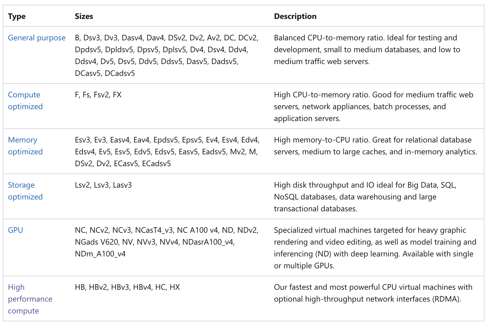
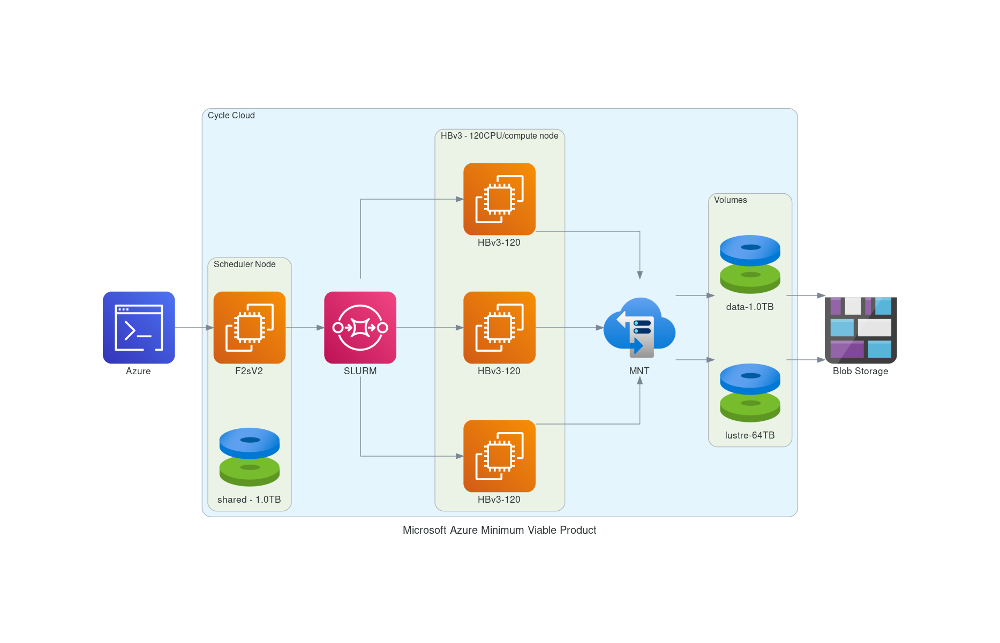

## System Requirements for a Single Virtual Machine or Cycle Cloud Cluster

### Please set up a alarm on Azure 
Set alarm to receive an email alert if you exceed $100 per month (or what ever monthly spending limit you need).
It may be possible to set up daily or weekly spending alarms as well.

### Azure Documentation on selecting the right VM for your workloads

<a href="https://docs.microsoft.com/en-us/azure/virtual-machines/sizes">Description of Azure Virtual Machines</a>

For CMAQ, it is recommended that the user select a High Performance Compute Virtual Machine.




## Software Requirements for CMAQ on Single VM or CycleCloud Cluster

The software requirements to run CMAQ on Azure are split into three tiers. The first tier includes the software that is provided with the operating system, the second tier includes the libraries required by CMAQ, the third tier includes the CMAQ code and associated pre and post processors, and the third tier includes the R software and packages requried by the analysis scripts for verifying output or doing a quality assurance of CMAQ.

Tier 1: Native Operating System (OS) and associated system libraries, compilers for both Single VM or Cycle Cloud Cluster

* Tcsh shell
* Alma Linux Gen. 2
* Git
* Compilers (C, C++, and Fortran) - GNU compilers version ≥ gcc (GCC) 9.2.0 (need to use module load gcc-9.2.0)
* MPI (Message Passing Interface) -  OpenMPI ≥ 4.1.0  (need to use module load mpi/openmpi-4.1.0)

Tier 1: For the Cycle Cloud Cluster

* Slurm Scheduler

Tier 2: additional libraries required for installing CMAQ

* NetCDF (with C, C++, and Fortran support)
* I/O API

Tier 3: Software distributed thru the CMAS Center

* CMAQv533
* CMAQv533 Post Processors

Tier 4: R packages and Scripts

* R QA Scripts

### Hardware Requirements

#### Recommended Minimum Requirements

The size of hardware depends on the domain size and resolution for  your CMAQ case, and how quickly your turn-around requirements are.
Larger hardware and memory configurations are also required for instrumented versions of CMAQ incuding CMAQ-ISAM and CMAQ-DDM3D.

### Azure Single Virtual Machine

Azure offers generalized, compute, and high performance machines of various sizes.
The amount of memory and the number of cpus required to run CMAQ depends on the domain size and resolution of the case that is being run.
For this tutorial that uses a two day run of the CONUS2 domain, a minimum size recommended is a HC44rs (44 cpus)  or HBv120 (120 cpus) compute node, to allow CMAQ to be run on up to 44 or 120 cpus.


### Azure CycleCloud Cluster

Azure CycleCloud Provides the simplest way to manage HPC workloads using any scheduler (like Slurm, Grid Engine, HPC Pack, HTCondor, LSF, PBS Pro, or Symphony).

CycleCloud allows you to:

* Deploy full clusters and other resources, including scheduler, compute VMs, storage, networking, and cache
* Orchestrate job, data, and cloud workflows
* Give admins full control over which users can run jobs, as well as where and at what cost
* Customize and optimize clusters through advanced policy and governance features, including cost controls, Active Directory integration, monitoring, and reporting
* Use your current job scheduler and applications without modification
* Take advantage of built-in autoscaling and battle-tested reference architectures for a wide range of HPC workloads and industries


<a href="https://docs.microsoft.com/en-us/azure/cyclecloud/?view=cyclecloud-8">Azure CycleCloud</a>


#### 12US2 Benchmark Domain Description

```
GRIDDESC
'12US2'
'12CONUS'     -2412000.0 -1620000.0 12000.0 12000.0 396 246 1
```


## Recommended Cycle Cloud Configuration for CONUS Domain 12US2

Note, first create a VM using the image: CycleCloud 8.2, and from that VM, the Cycle Cloud is built.
VM:

*F4sV2 (4vcpus, 8 GiB memory) - VM image: CycleCloud 8.2

CycleCloud Configuration:

Scheduler node:

* D4s_v3

Compute Node for HTC Queue - used for Post-Processing (combine, etc):

* F2sV2 (part of the Fsv2-series instances)

Compute Node for HPC Queue - used to run CMAQ:

*  HBv3-120 instance running AlmaLinux 

<a href="https://docs.microsoft.com/en-us/azure/virtual-machines/workloads/hpc/hbv3-series-overview#software-specifications">HBv3-series Software Specification</a>

448 GB of RAM, and no hyperthreading with 350 GB/sec of memory bandwidth, up to 32 MB of L3 cache per core, up to 7 GB/s of block device SSD performance, and clock frequencies up to 3.675 GHz.

Figure 1. Cycle Cloud Recommended Cluster Configuration (Number of compute nodes depends on setting for NPCOLxNPROW and #SBATCH --nodes=XX #SBATCH --ntasks-per-node=YY )



#### Azure CycleCloud specifies what resource to use for disks, scheduler node, and compute nodes. 
Cycle Cloud simply tries to schedule the job according to the slurm scheduler instructions. Slurm controls the launch, terminate, and maintain resources.
If you try to allocate more nodes than are available in the Cycle Cloud Configuration, then you will need to 
edit the HPC config in the cyclecloud web interface to set the CPUs to 480 or more and then run the following on the scheduler node the changes should get picked up:

`cd /opt/cycle/slurm`

`sudo ./cyclecloud_slurm.sh scale`

Number of compute nodes dispatched by the slurm scheduler is specified in the run script using #SBATCH --nodes=XX #SBATCH --ntasks-per-node=YY where the maximum value of tasks per node or YY limited by many CPUs are on the compute node.  

For HBv3-120, there are 120 CPUs, so maximum value of YY is 120 or --ntask-per-node=120.  

If running a job with 180 processors, this would require the --nodes=XX or XX to be set to 2 compute nodes, as 90x2=180.  

The setting for NPCOLxNPROW must also be a maximum of 180, ie. 18 x 10 or 10 x 18 to use all of the CPUs in the CycleCloud HPC Node.


<a href="https://docs.microsoft.com/en-us/azure/virtual-machines/hbv3-series">HBv3-120 instance </a>


Software: 

* Alma Linux
* Spot or OnDemand Pricing 
* /shared/build volume install software from git repo
* 1. TB Shared file system 
* Slurm Placement Group enabled
* Elastic Fabric Adapter Enabled on HBv3-120
