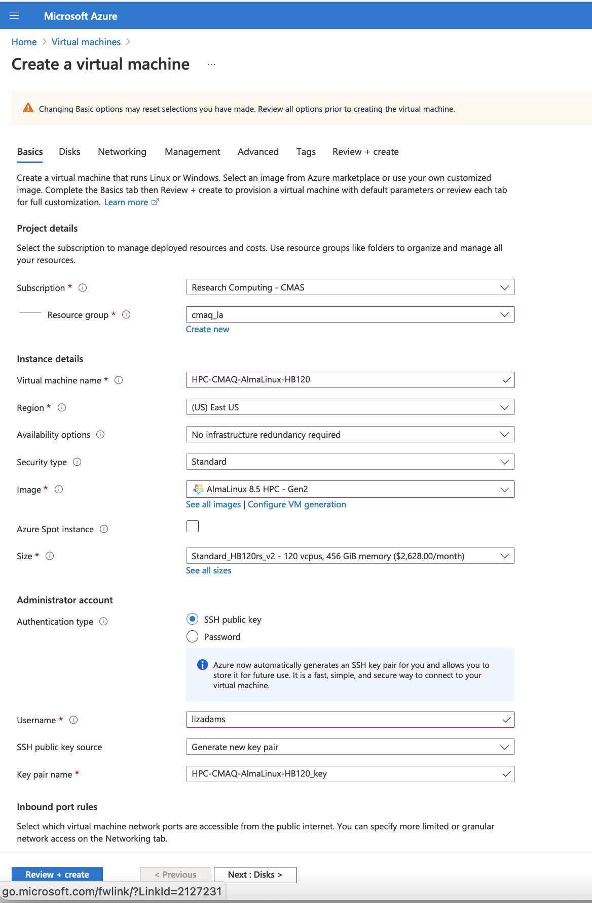

## Run CMAQ from HBv120 Compute Node

Provide instructions to build and install CMAQ on HBv120 compute node installed from HPC AlmaLinux 8.5 HPC-Gen2 Image that provides modules for git, openmpi and gcc.
The compute node does not have a SLURM scheduler on it, so jobs are run interactively from the command line. 

Instructions to install data and CMAQ libraries and model are provided along with sample run scripts to run CMAQ on 16, 36, 90, and 120 processors on a single HBv120 instance.

This will provide users with Azure Portal to create a Virtual Machine, select AlmaLinux 8.5 HPC - Gen2 as the image, select the size of the VM as HB120rs_v2 - 120 vcpus, 456 GiB memory, using an SSH public key to login and install and run CMAQ.

Using this method, the user needs to be careful to start and stop the Virtual Machine and only have it run while doing the intial installation, and while running CMAQ.
The full HBv120 instance will incurr charges as long as it is on, even if a job isn't running on it.

This is different than the Azure Cycle-Cloud, where if CMAQ is not running in the queue, then the HBv120 Compute nodes are down, and not incurring costs.

1. Login to Azure Portal
2. Select Create a Virtual Machine
3. Click on See all images next to Image and use the search bar to search for HPC. Look for the AlmaLinux 8.5 HPC.
Select either the Gen 1 or Gen 2, and click. That option should now pre-populate the form.
4. Select Size - Standard_HB1120rs_v2 - 120 vcpus, 456 GiB memory ($2,628.0/monthly)
5. Enter a Virtual Machine Name in the text box
6. Use your username or azureuser
7. Select Authentication type - SSH public key
8. Select SSH public key source - Generate new key pair



Click on Next > Disks

1. Click on Create and attach a new disk - select a 1TB disk
2. Select Checkbox to Delete disk with VM


(note, this will create the disk, but you will need to login and mount the disk as the shared volume following the instructions below.)

Click on Next > Management

1. Select check box for Identity > System assigned managed identity


Click on Next > Advanced

don't need to change anything


Click on Next > Tags

don't change anything

Click on Next > Review and create


Click on download public key and provision resource


Click on Go to Resource once the deployment is completed.


Login using ssh to the IP address using the public key.

Change the permissions on the public key using command

`chmod 400  HPC-CMAQ-AlmaLinux-HB120_key.pem`

Login to the Virtual Machine

`ssh -Y -i ./xxxxxxx_key.pem username@xx.xx.xx.xx`

Mount the disk on the server as /shared using the instructions on the following link:

<a href="https://docs.microsoft.com/en-us/azure/virtual-machines/linux/add-disk">Mount Disk on Azure Linux Virtual Machine</a>

Find the disk

`lsblk -o NAME,HCTL,SIZE,MOUNTPOINT | grep -i "sd"`

Output:

```
sda     0:0:0:0       30G 
├─sda1               500M /boot
├─sda2                29G /
├─sda14                4M 
└─sda15              495M /boot/efi
sdb     0:0:0:1      480G 
└─sdb1               480G /mnt
sdc     1:0:0:0        1T 
```

In the above case, the IT disk was added as sdc

Format the disk

```
sudo parted /dev/sdc --script mklabel gpt mkpart xfspart xfs 0% 100%
sudo mkfs.xfs /dev/sdc1
sudo partprobe /dev/sdc1
```

Mount the disk

`sudo mkdir /shared`

Use mount to mount the filesystem

`sudo mount /dev/sdc1 /shared`

Persist the mount

`sudo blkid`

Output

```
/dev/sdb1: UUID="109f262f-36bb-431d-b1c0-9a9dad39b894" BLOCK_SIZE="4096" TYPE="ext4" PARTUUID="111c5d20-01"
/dev/sda1: UUID="9643d043-09b2-4bfa-9842-079b985d4d15" BLOCK_SIZE="512" TYPE="xfs" PARTUUID="cd39399b-65c3-4a21-89d1-129b241d7e4d"
/dev/sda2: UUID="943e4d7b-9391-47b5-916c-f51afcdc512f" BLOCK_SIZE="512" TYPE="xfs" PARTUUID="0a95f633-83e4-41bf-b6b1-da9ebc5bf5d7"
/dev/sda15: SEC_TYPE="msdos" UUID="3DB8-F6B8" BLOCK_SIZE="512" TYPE="vfat" PARTLABEL="EFI System Partition" PARTUUID="75d05630-884d-4f11-abb5-6ce3331c7528"
/dev/sdc1: UUID="09e461c7-2ac6-4e07-b3c8-6e7f593dfba2" BLOCK_SIZE="4096" TYPE="xfs" PARTLABEL="xfspart" PARTUUID="649e7f66-057a-4460-ab92-661542ae9196"
/dev/sda14: PARTUUID="14abf57d-419d-4263-8078-aa7a849c1d58"
```

Next, open the /etc/fstab file in a text editor as follows:

`sudo nano /etc/fstab`

In this example, use the UUID value for the /dev/sdc1 device that was created in the previous steps, and the mountpoint of /shared. Add the following line to the end of the /etc/fstab file:

`UUID=09e461c7-2ac6-4e07-b3c8-6e7f593dfba2    /shared   xfs   defaults,nofail   1   2

Change directories and verify that you see the /shared directory with Size of 1T 

`cd /shared`

`df -h`

Output

```
Filesystem      Size  Used Avail Use% Mounted on
devtmpfs        213G     0  213G   0% /dev
tmpfs           213G     0  213G   0% /dev/shm
tmpfs           213G   17M  213G   1% /run
tmpfs           213G     0  213G   0% /sys/fs/cgroup
/dev/sda2        30G   11G   19G  37% /
/dev/sda1       495M  193M  302M  39% /boot
/dev/sda15      495M  5.8M  489M   2% /boot/efi
/dev/sdb1       472G   73M  448G   1% /mnt
tmpfs            43G     0   43G   0% /run/user/1000
/dev/sdc1       1.0T  7.2G 1017G   1% /shared
```

Create a /shared/build, /shared/data and /shared/cyclecloud-cmaq directory and change the permissions from root to your username.

```
cd /shared
sudo mkdir build
sudo mkdir data
sudo mkdir cyclecloud-cmaq
```

Change the ownership to your username

```
sudo chown lizadams /shared/build
sudo chown lizadams /shared/data
sudo chown lizadams//shared/cyclecloud-cmaq
```

Change the group to your username

```
sudo chgrp lizadams /shared/build
sudo chgrp lizadams /shared/data
sudo chgrp lizadams /shared/cyclecloud-cmaq
```

Obtain the Cyclecloud-cmaq code from github

Load the git module

```
module load module-git
```

(note I couldn't find git after loading the above module.  Need to load git by hand)
(or it may have been because I was in the csh shell and not the bash shell.)


`sudo yum install git`


Load the openmpi module

```
module load mpi/openmpi-4.1.1 
```

Install Cycle Cloud

`git clone -b main https://github.com/lizadams/cyclecloud-cmaq.git`

Install and build netcdf C, netcdf Fortran, I/O API, and CMAQ

`cd /shared/cyclecloud-cmaq`

Install netcdf-C and netcdf-Fortran

`./gcc_install.csh`

If successful, you will see the following output, that at the bottom shows what versions of the netCDF library were installed.

```
+-------------------------------------------------------------+
| Congratulations! You have successfully installed the netCDF |
| Fortran libraries.                                          |
|                                                             |
| You can use script "nf-config" to find out the relevant     |
| compiler options to build your application. Enter           |
|                                                             |
|     nf-config --help                                        |
|                                                             |
| for additional information.                                 |
|                                                             |
| CAUTION:                                                    |
|                                                             |
| If you have not already run "make check", then we strongly  |
| recommend you do so. It does not take very long.            |
|                                                             |
| Before using netCDF to store important data, test your      |
| build with "make check".                                    |
|                                                             |
| NetCDF is tested nightly on many platforms at Unidata       |
| but your platform is probably different in some ways.       |
|                                                             |
| If any tests fail, please see the netCDF web site:          |
| https://www.unidata.ucar.edu/software/netcdf/                |
|                                                             |
| NetCDF is developed and maintained at the Unidata Program   |
| Center. Unidata provides a broad array of data and software |
| tools for use in geoscience education and research.         |
| https://www.unidata.ucar.edu                                 |
+-------------------------------------------------------------+

make[3]: Leaving directory '/shared/build/netcdf-fortran-4.5.4'
make[2]: Leaving directory '/shared/build/netcdf-fortran-4.5.4'
make[1]: Leaving directory '/shared/build/netcdf-fortran-4.5.4'
netCDF 4.8.1
netCDF-Fortran 4.5.4
```

Install I/O API

`./gcc_ioapi.csh`


Install CMAQ

`./gcc_cmaq.csh`


Find the operating system

` cat /etc/os-release`

Output

```
NAME="AlmaLinux"
VERSION="8.5 (Arctic Sphynx)"
ID="almalinux"
ID_LIKE="rhel centos fedora"
VERSION_ID="8.5"
PLATFORM_ID="platform:el8"
PRETTY_NAME="AlmaLinux 8.5 (Arctic Sphynx)"
ANSI_COLOR="0;34"
CPE_NAME="cpe:/o:almalinux:almalinux:8::baseos"
HOME_URL="https://almalinux.org/"
DOCUMENTATION_URL="https://wiki.almalinux.org/"
BUG_REPORT_URL="https://bugs.almalinux.org/"

ALMALINUX_MANTISBT_PROJECT="AlmaLinux-8"
ALMALINUX_MANTISBT_PROJECT_VERSION="8.5"
```

Change shell to use tcsh

`sudo usermod -s /bin/tcsh lizadams`


Log out and then log back in to have the shell take effect.

Copy a file to set paths 

`cd /shared/cyclecloud-cmaq`

`cp dot.cshrc.vm ~/.cshrc`

Install and Build CMAQ

`./gcc_cmaq.csh`

Verfify that the executable was successfully built.

`ls /shared/build/openmpi_gcc/CMAQ_v533/CCTM/scripts/BLD_CCTM_v533_gcc/*.exe`

Output

```
/shared/build/openmpi_gcc/CMAQ_v533/CCTM/scripts/BLD_CCTM_v533_gcc/CCTM_v533.exe
```

Copy the run scripts from the repo to the run directory

`cd /shared/build/openmpi_gcc/CMAQ_v533/CCTM/scripts`

`cp /shared/cyclecloud-cmaq/run_scripts/HB120v3/*pe.csh .`

List the scripts available

`ls -rlt *pe.csh*`

Output

```
run_cctm_2016_12US2.90pe.csh
run_cctm_2016_12US2.36pe.csh
run_cctm_2016_12US2.16pe.csh
run_cctm_2016_12US2.120pe.csh
```

Run CMAQ using all 120 processors

First, examing the run scripts and also download the input data using the aws command line.

Install aws command line

see https://docs.aws.amazon.com/cli/latest/userguide/getting-started-install.html


`cd /shared/build`

`curl "https://awscli.amazonaws.com/awscli-exe-linux-x86_64.zip" -o "awscliv2.zip"`

`unzip awscliv2.zip`

`sudo ./aws/install`


Install the input data using the s3 script

`cd /shared/cyclecloud-cmaq/s3_scripts/`

`./s3_copy_nosign_conus_cmas_opendata_to_shared.csh`

Note, this Virtual Machine does not have Slurm installed or configured.

Run CMAQ interactively using the following command:

`cd /shared/build/openmpi_gcc/CMAQ_v533/CCTM/scripts`

`./run_cctm_2016_12US2.120pe.csh |& tee ./run_cctm_2016_12US2.120pe.log`


