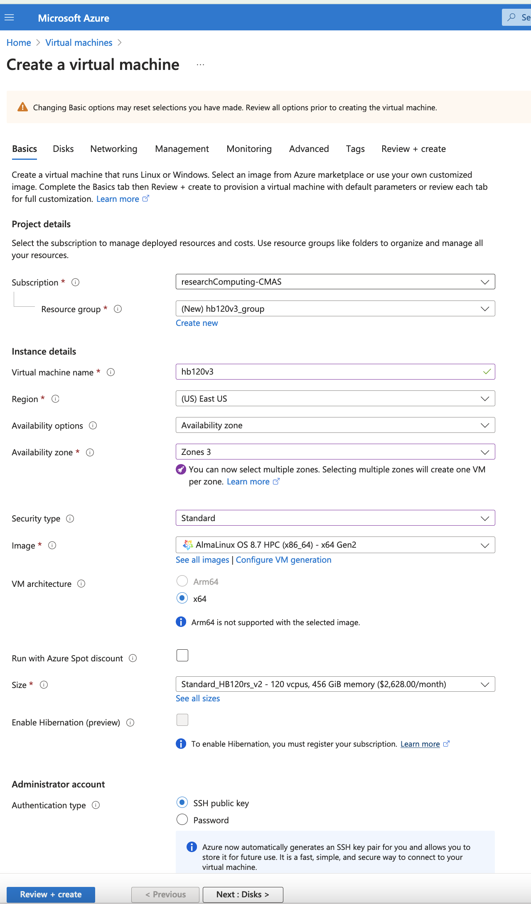
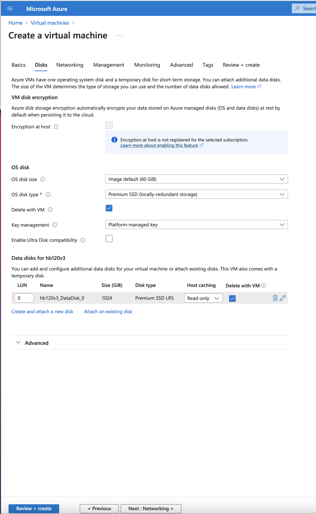

Intermediate Tutorial: Run CMAQ from HBv120 Compute Node for CMAQv5.4

Estimated workflow time:  2-3 hours for the complete install input data, build, and run.

Instructions are provided to build and install CMAQ on HBv120 compute node installed from HPC AlmaLinux 8.7 HPC-Gen2 Image that contains modules for git, openmpi and gcc.

The compute node does not have a SLURM scheduler on it, so jobs are run interactively from the command line. 

Instructions to install data and CMAQ libraries and model are provided along with sample run scripts to run CMAQ on 96 processors on a single HB120_v3 (120 cpus) instance.

This will provide users with experience using the Azure Portal to create a Virtual Machine, select AlmaLinux 8.7 HPC - Gen2 as the image, select the size of the VM as HB120rs_v3 - 120 vcpus, 456 GiB memory, using an SSH private key to login and install and run CMAQ.

```{warning}
Using this method, the user needs to be careful to start and stop the Virtual Machine and only have it run while doing the intial installation, and while running CMAQ.  The full HBv120 instance will incur charges as long as it is on, even if a job isn't running on it.
This is different than the Azure Cycle-Cloud, where if CMAQ is not running in the queue, then the HBv120 Compute nodes are down, and not incurring costs.
```

## Create a HB120rs_v3 Virtual Machine

1. Login to Azure Portal
2. Select Create a Virtual Machine
3. Click on See all images next to Image and use the search bar to search for HPC. Look for the AlmaLinux 8.7 HPC.
Select Gen 2, and click. That option should now pre-populate the form.
4. Select Size - Standard_HB120rs_v3 - 120 vcpus, 456 GiB memory ($2,628.0/monthly)
5. Enter a Virtual Machine Name in the text box
6. Use your username or azureuser
7. Select Authentication type - SSH public key
8. Select SSH public key source - Generate new key pair




To find the HB120rs_v3 size, click on "see all sizes"
Then search for hb120
The select "Other Sizes"
And then select HB120rs_v3

For some reason, the instance isn't available under the "H series" only the HB120rs_v2 is available there.


Click on Next > Disks

1. Click on Create and attach a new disk - select a 1TB disk
2. Select Checkbox to Delete disk with VM



(note, this will create the disk, but you will need to login and mount the disk as the shared volume following the instructions below.)

3. Create new Disk


Click on Next > Management

1. Select check box for Identity > System assigned managed identity


Click on Next > Advanced

don't need to change anything


Click on Next > Tags

don't change anything

Click on Next > Review and create

!!!

Click on download private key and provision resource


Click on Go to Resource once the deployment is completed.


Click on Go to resource to get the IP address.

## Login to the Virtual Machine 

Change the permissions on the public key using command

```
chmod 400  HPC-CMAQ-AlmaLinux-HB120_key.pem
```

Login to the Virtual Machine using ssh to the IP address using the public key.

```
ssh -Y -i ./xxxxxxx_key.pem username@xx.xx.xx.xx
```

## Mount the disk on the server as /shared using the instructions on the following link:

<a href="https://docs.microsoft.com/en-us/azure/virtual-machines/linux/add-disk">Mount Disk on Azure Linux Virtual Machine</a>

### Find the disk

```
lsblk -o NAME,HCTL,SIZE,MOUNTPOINT | grep -i "sd"
```

Output:

```
sda     1:0:0:0        1T 
sdb     0:0:0:0       60G 
├─sdb1              1000M /boot
├─sdb2              58.5G /
├─sdb14                4M 
└─sdb15              495M /boot/efi
sdc     0:0:0:1      480G 
└─sdc1               480G /mnt

```

In the above case, the 1 Terrabyte (1T)  disk was added as sdc

### Format the disk

```
sudo parted /dev/sda --script mklabel gpt mkpart xfspart xfs 0% 100%
sudo mkfs.xfs /dev/sda1
sudo partprobe /dev/sda1
```

### Mount the disk

```
sudo mkdir /shared
```

### Use mount to mount the filesystem

```
sudo mount /dev/sda1 /shared
```

### Persist the mount

grep sda1 UID using the command:

```
sudo blkid | grep -i sda1
```

Output

```
/dev/sda1: UUID="97ac20d7-b884-4671-9619-7248b529975c" BLOCK_SIZE="4096" TYPE="xfs" PARTLABEL="xfspart" PARTUUID="a25cfda9-3d62-42cf-86c2-5fba2f6fa440"
```

### Edit fstab 

Next, open the /etc/fstab file in a text editor as follows:

```
sudo nano /etc/fstab
```

In this example, use the UUID value for the /dev/sdc1 device that was created in the previous steps, and the mountpoint of /shared. Add the following line to the end of the /etc/fstab file:

`UUID=09e461c7-2ac6-4e07-b3c8-6e7f593dfba2    /shared   xfs   defaults,nofail   1   2`

### Verify the /shared directory

Change directories and verify that you see the /shared directory with Size of 1T 

```
cd /shared
df -h
```

Output

```
Filesystem      Size  Used Avail Use% Mounted on
devtmpfs        213G     0  213G   0% /dev
tmpfs           213G     0  213G   0% /dev/shm
tmpfs           213G   17M  213G   1% /run
tmpfs           213G     0  213G   0% /sys/fs/cgroup
/dev/sda2        30G   11G   19G  37% /
/dev/sda1       495M  193M  302M  39% /boot
/dev/sda15      495M  5.8M  489M   2% /boot/efi
/dev/sdb1       472G   73M  448G   1% /mnt
tmpfs            43G     0   43G   0% /run/user/1000
/dev/sdc1       1.0T  7.2G 1017G   1% /shared
```

### Create subdirectories on /shared

Create a /shared/build, /shared/data and /shared/cyclecloud-cmaq directory and change the permissions from root to your username.

```
cd /
sudo chown azureuser shared
sudo chgrp azureuser shared

cd /shared
mkdir build
mkdir data
mkdir cyclecloud-cmaq
```

## Alternatively, you can create an nvme stripped disk that has faster performance.

```
mkdir -p /mnt/nvme
mdadm --create /dev/md10 --level 0 --raid-devices 2 /dev/nvme0n1 /dev/nvme1n1
mkfs.xfs /dev/md10
mount /dev/md10 /mnt/nvme
chmod 1777 /mnt/nvme
```

That should create a file system with about 1.8TiB

## Download the Input data from the S3 Bucket

### Install aws command line

see <a href="https://docs.aws.amazon.com/cli/latest/userguide/getting-started-install.html">Install AWS CLI</a>

```
cd /shared/build
curl "https://awscli.amazonaws.com/awscli-exe-linux-x86_64.zip" -o "awscliv2.zip"
unzip awscliv2.zip
sudo ./aws/install
```


### Install the uncompressed 2018_12US1 input data using the s3 script

```
cd /shared/cyclecloud-cmaq/s3_scripts/
./s3_copy_nosign_2018_12US1_conus_cmas_opendata_to_shared_20171222_cb6r5_uncompressed.csh
```

Note, you should be getting fast transfer speeds in the 200 MiB/s range, so downloading the files should take 10 minutes.


### Load the openmpi module

```
module load mpi/openmpi-4.1.5
```


### Install Cycle Cloud Repo

```
git clone -b main https://github.com/CMASCenter/cyclecloud-cmaq.git
```

### Install and build netcdf C, netcdf Fortran, I/O API, and CMAQ

```
cd /shared/cyclecloud-cmaq
```

Install netcdf-C and netcdf-Fortran

```
./gcc_install.csh
```

If successful, you will see the following output, that at the bottom shows what versions of the netCDF library were installed.

```
+-------------------------------------------------------------+
| Congratulations! You have successfully installed the netCDF |
| Fortran libraries.                                          |
|                                                             |
| You can use script "nf-config" to find out the relevant     |
| compiler options to build your application. Enter           |
|                                                             |
|     nf-config --help                                        |
|                                                             |
| for additional information.                                 |
|                                                             |
| CAUTION:                                                    |
|                                                             |
| If you have not already run "make check", then we strongly  |
| recommend you do so. It does not take very long.            |
|                                                             |
| Before using netCDF to store important data, test your      |
| build with "make check".                                    |
|                                                             |
| NetCDF is tested nightly on many platforms at Unidata       |
| but your platform is probably different in some ways.       |
|                                                             |
| If any tests fail, please see the netCDF web site:          |
| https://www.unidata.ucar.edu/software/netcdf/                |
|                                                             |
| NetCDF is developed and maintained at the Unidata Program   |
| Center. Unidata provides a broad array of data and software |
| tools for use in geoscience education and research.         |
| https://www.unidata.ucar.edu                                 |
+-------------------------------------------------------------+

make[3]: Leaving directory '/shared/build/netcdf-fortran-4.5.4'
make[2]: Leaving directory '/shared/build/netcdf-fortran-4.5.4'
make[1]: Leaving directory '/shared/build/netcdf-fortran-4.5.4'
netCDF 4.8.1
netCDF-Fortran 4.5.4
```

Install I/O API

```
./gcc_ioapi.csh
```


Find what operating system is on the system:

```
cat /etc/os-release
```

Output

```
NAME="AlmaLinux"
VERSION="8.7 (Stone Smilodon)"
ID="almalinux"
ID_LIKE="rhel centos fedora"
VERSION_ID="8.7"
PLATFORM_ID="platform:el8"
PRETTY_NAME="AlmaLinux 8.7 (Stone Smilodon)"
ANSI_COLOR="0;34"
LOGO="fedora-logo-icon"
CPE_NAME="cpe:/o:almalinux:almalinux:8::baseos"
HOME_URL="https://almalinux.org/"
DOCUMENTATION_URL="https://wiki.almalinux.org/"
BUG_REPORT_URL="https://bugs.almalinux.org/"

ALMALINUX_MANTISBT_PROJECT="AlmaLinux-8"
ALMALINUX_MANTISBT_PROJECT_VERSION="8.7"
REDHAT_SUPPORT_PRODUCT="AlmaLinux"
REDHAT_SUPPORT_PRODUCT_VERSION="8.7"

```

## Change shell to use tcsh

```
sudo usermod -s /bin/tcsh azureuser
```


Log out and then log back in to have the shell take effect.

Copy a file to set paths 

```
cd /shared/cyclecloud-cmaq
cp dot.cshrc.vm ~/.cshrc
```

## Create Environment Module for Libraries

There are two steps required to create your own custome module:

1. write a module file

2. add a line to your ~/.cshrc to update the MODULEPATH

Create a new custom module that will be loaded including any dependencies using the following command:

```
module load ioapi-3.2/netcdf  **example only
```

Step 1: Create the module file.

First, create a path to store the module file. The path must contain /Modules/modulefiles/ and should have the general form
/<path to>/Modules/modulefiles/<module-name>/<version> where <version> is typically numerical and is the actual module file.  

```
mkdir -p /shared/build/Modules/modulefiles/ioapi-3.2_20200828
```

Next, create the module file and save it in the directory above.

```
cd /shared/build/Modules/modulefiles/ioapi-3.2_20200828
```

```
vim gcc-9.2.0-netcdf
```

Contents of gcc-9.2.0-netcdf:

```
#%Module
  
proc ModulesHelp { } {
   puts stderr "This module adds ioapi-3.2_20200828/gcc-9.2.0 to your path"
}

module-whatis "This module adds ioapi-3.2_20200828/gcc-9.2.0 to your path\n"

set basedir "/shared/build/ioapi-3.2_branch_20200828/"
prepend-path PATH "${basedir}/Linux2_x86_64gfort"
prepend-path LD_LIBRARY_PATH "${basedir}/ioapi/fixed_src"
module load mpi/openmpi-4.1.5
module load gcc-9.2.0
module load netcdf-4.8.1/gcc-9.2.0
```

The example module file above sets two evironment variables and loads two system modules and a custom module (that we also need to define).

The modules update the PATH and LD_LIBRARY_PATH. 

Now create the custom module to define the netCDF libraries that were used to build I/O API.

```
mkdir /shared/build/Modules/modulefiles/netcdf-4.8.1
cd /shared/build/Modules/modulefiles/netcdf-4.8.1
vim gcc-9.2.0
```

Contents of gcc-9.2.0

```
#%Module
  
proc ModulesHelp { } {
   puts stderr "This module adds netcdf-4.8.1/gcc-9.2.0 to your path"
}

module-whatis "This module adds netcdf-4.8.1/gcc-9.2.0 to your path\n"

set basedir "/shared/build/netcdf"
prepend-path PATH "${basedir}/bin"
prepend-path LD_LIBRARY_PATH "${basedir}/lib"
module load mpi/openmpi-4.1.5
module load gcc-9.2.0
```


Step 2: Add the module path to MODULEPATH.

Now that the two custom module files have been created, add the following line to your ~/.cshrc file so that they can be found:

```
vi ~/.cshrc
```

Add the following line to your .cshrc

```
module use --append /shared/build/Modules/modulefiles
```

Source the .cshrc file

```
source ~/.cshrc
```

Step 3: View the modules available after creation of the new module

The module avail command shows the paths to the module files on a given cluster.

```
module avail
```

Step 4: Load the new module

```
module load ioapi-3.2_20200828/gcc-9.2.0-netcdf
```

Output:

```
Loading ioapi-3.2_20200828/gcc-9.2.0-netcdf
  Loading requirement: gcc-9.2.1 mpi/openmpi-4.1.1 netcdf-4.8.1/gcc-9.2.0
```

Verify that the libraries required for netCDF and I/O API have been added to the $LD_LIBRARY_PATH  environment variable

```
echo $LD_LIBRARY_PATH
```

Output:

```
/shared/build/ioapi-3.2_branch_20200828//ioapi/fixed_src:/opt/openmpi-4.1.5/lib:/opt/gcc-9.2.0/lib64:/shared/build/netcdf/lib
```

Verify that the I/O API bin directory and netCDF bin directory that you specified in the custom module has been added to the $PATH environment variable 

```
 echo $PATH
```

Output

```
/shared/build/ioapi-3.2_branch_20200828//Linux2_x86_64gfort:/opt/openmpi-4.1.5/bin:/opt/gcc-9.2.0/bin:/usr/share/Modules/bin:/usr/local/bin:/usr/bin:/usr/local/sbin:/usr/sbin:/shared/build/netcdf/bin:/shared/build/ioapi-3.2/Linux2_x86_64gfort:/opt/slurm/bin/:/usr/local/bin
```

see <a href="https://researchcomputing.princeton.edu/support/knowledge-base/custom-modules">Custom-Modules from Princeton Research Computing</a>


## Install and Build CMAQ

```
./gcc_cmaqv54+.csh
```

Verfify that the executable was successfully built.

```
ls /shared/build/openmpi_gcc/CMAQ_v54/CCTM/scripts/BLD_CCTM_v54_gcc/*.exe
```

Output

```
/shared/build/openmpi_gcc/CMAQ_v54/CCTM/scripts/BLD_CCTM_v54_gcc/CCTM_v54.exe
```

## Copy the run scripts from the repo to the run directory

```
cd /shared/build/openmpi_gcc/CMAQ_v54/CCTM/scripts
cp /shared/cyclecloud-cmaq/run_scripts/run_cctm_2018_12US1_v54_cb6r5_ae6.20171222.96.ncclassic.csh .
```  

Note, this Virtual Machine does not have Slurm installed or configured. Also note, the first few timings reported here were using the HB120_v2, instead of HB120_v3. See the last timing report for the HB120_v3, which is much faster.

## Run CMAQ interactively using the following command:

```
cd /shared/build/openmpi_gcc/CMAQ_v54/CCTM/scripts
./run_cctm_2018_12US1_v54_cb6r5_ae6.20171222.96.ncclassic.csh |& tee ./run_cctm_2018_12US1_v54_cb6r5_ae6.20171222.96.ncclassic.log
```

When the run has completed, record the timing of the two day benchmark.

```
tail -n 30  run_cctm_2018_12US1_v54_cb6r5_ae6.20171222.96.ncclassic.log
```

Output:

```
==================================
  ***** CMAQ TIMING REPORT *****
==================================
Start Day: 2017-12-22
End Day:   2017-12-23
Number of Simulation Days: 2
Domain Name:               12US1
Number of Grid Cells:      4803435  (ROW x COL x LAY)
Number of Layers:          35
Number of Processes:       96
   All times are in seconds.

Num  Day        Wall Time
01   2017-12-22   3175.9
02   2017-12-23   3484.4
     Total Time = 6660.30
      Avg. Time = 3330.15
```

If runs are submitted immediately after a successful completion of a run, then you may skey the scaling results.
It would be ideal to wait 30 minutes before running a second job. 

### Run second job interactively using the following command:

```
./run_cctm_2018_12US1_v54_cb6r5_ae6.20171222.1x120.ncclassic.csh |& tee ./run_cctm_2018_12US1_v54_cb6r5_ae6.20171222.1x120.ncclassic.log
```

Output

```
tail -n 18 ./run_cctm_2018_12US1_v54_cb6r5_ae6.20171222.1x120.ncclassic.log
```


```
==================================
  ***** CMAQ TIMING REPORT *****
==================================
Start Day: 2017-12-22
End Day:   2017-12-23
Number of Simulation Days: 2
Domain Name:               12US1
Number of Grid Cells:      4803435  (ROW x COL x LAY)
Number of Layers:          35
Number of Processes:       96
   All times are in seconds.

Num  Day        Wall Time
01   2017-12-22   3075.2
02   2017-12-23   3477.9
     Total Time = 6553.10
      Avg. Time = 3276.55


```

## Created another single VM using HBv120_v2 and ran again

```
cd /shared/build/openmpi_gcc/CMAQ_v54/CCTM/scripts
./run_cctm_2018_12US1_v54_cb6r5_ae6.20171222.1x96.ncclassic.csh |& tee ./run_cctm_2018_12US1_v54_cb6r5_ae6.20171222.1x96.ncclassic.log
```

When it finished, examined the log file:

```
tail -n 18 run_cctm_2018_12US1_v54_cb6r5_ae6.20171222.1x96.ncclassic.log
```

Output:

```
==================================
  ***** CMAQ TIMING REPORT *****
==================================
Start Day: 2017-12-22
End Day:   2017-12-23
Number of Simulation Days: 2
Domain Name:               12US1
Number of Grid Cells:      4803435  (ROW x COL x LAY)
Number of Layers:          35
Number of Processes:       96
   All times are in seconds.

Num  Day        Wall Time
01   2017-12-22   3069.9
02   2017-12-23   3445.2
     Total Time = 6515.10
      Avg. Time = 3257.55
```

## Created another VM using the HB120v3 cpus

## Verify that the correct number of cpus are installed using lscpu

```
lscpu
```


Output:

```
[azureuser@hb120v3manish output_v54_cb6r5_ae7_aq_WR413_MYR_gcc_2018_12US1_2x64_classic]$ lscpu
Architecture:        x86_64
CPU op-mode(s):      32-bit, 64-bit
Byte Order:          Little Endian
CPU(s):              120
On-line CPU(s) list: 0-119
Thread(s) per core:  1
Core(s) per socket:  60
Socket(s):           2
NUMA node(s):        4
Vendor ID:           AuthenticAMD
CPU family:          25
Model:               1
Model name:          AMD EPYC 7V73X 64-Core Processor
Stepping:            2
CPU MHz:             3094.426
BogoMIPS:            3693.10
Hypervisor vendor:   Microsoft
Virtualization type: full
L1d cache:           32K
L1i cache:           32K
L2 cache:            512K
L3 cache:            98304K
NUMA node0 CPU(s):   0-29
NUMA node1 CPU(s):   30-59
NUMA node2 CPU(s):   60-89
NUMA node3 CPU(s):   90-119

has context menu
```

## Timing information

```
==================================
  ***** CMAQ TIMING REPORT *****
==================================
Start Day: 2017-12-22
End Day:   2017-12-23
Number of Simulation Days: 2
Domain Name:               12US1
Number of Grid Cells:      4803435  (ROW x COL x LAY)
Number of Layers:          35
Number of Processes:       96
   All times are in seconds.
 
Num  Day        Wall Time
01   2017-12-22   2818.3
02   2017-12-23   3205.8
     Total Time = 6024.10
      Avg. Time = 3012.05

```

The HB120_v3 has much faster performance than the HB120_v2.

## Review performance metrics in the Azure portal

https//portal.azure.coom

Click on Virtual Machines

Select the Virtual Machine that you created

Under Essentials, click on Monitoring, and then pin the CPU Average and Disk bytes total to a shared dashboard.

Then under the Azure Portal search for shared dashboards

Follow that link to Go to Dashboard.

You can click in the upper right of each dashboard on the ... and select Configure Dashboard to specify the time period (ie. past hour, or past 4 hours.  In this example, the past hour time period was used.


Second image saved after the inital s3 copy data transfer had been completed, giving a scale that allows you to see the transfer rate.


Full time to install input data, build code, and run CMAQv5.4+ for the 12US1 domain on HB120rs_v3 using 96 of 120 cpus.


## IF your performance is much slower than this, then we recommend that you terminate the resource group and re-build the VM


