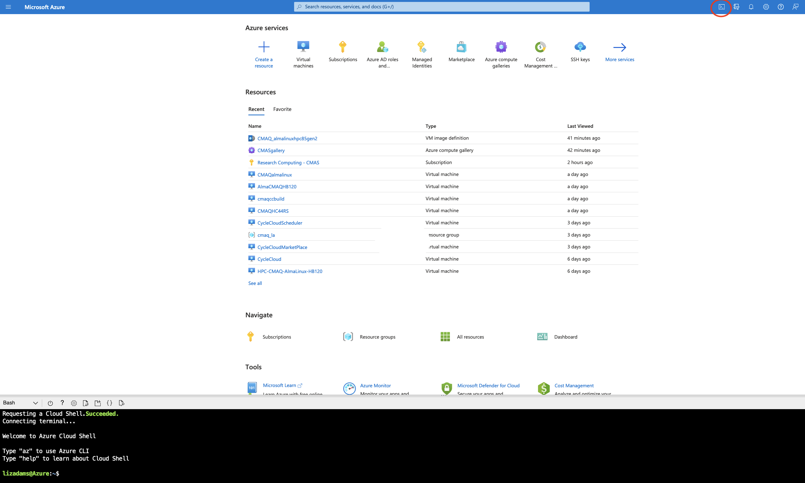
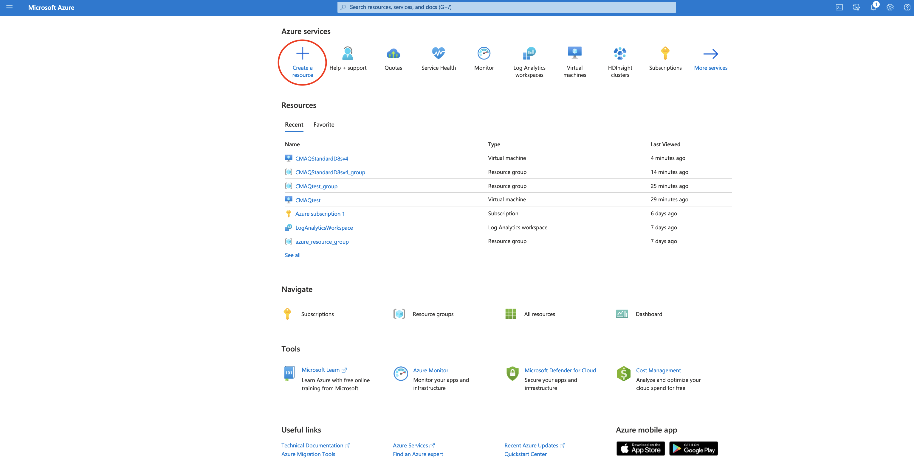
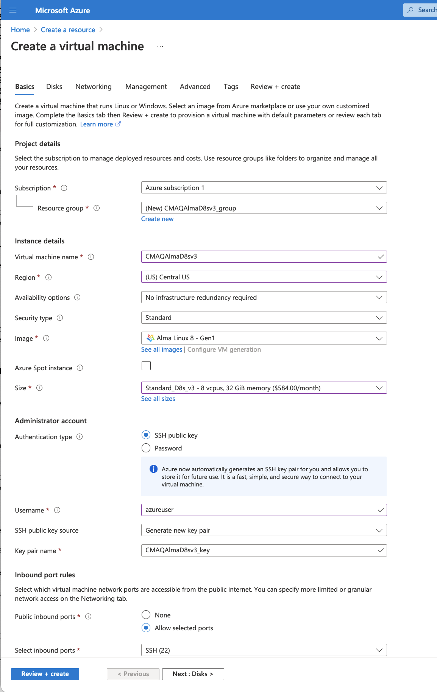

Introductory Tutorial

## Create an Azure Account

Create an account and configure your azure cyclecloud credentials.
<a href="https://azure.microsoft.com/en-us/free/">Create Free Azure Account</a>

## Sign up for a Developer Azure Support Plan

New accounts may be restricted to what virtual machines can be created by quota.
With a pay-as-you go account or a free account, you need to sign up for the $29.99 per month support account in order to create a support request to increase the quota limit for the HC44rs or the HBv120 machines that are used in this tutorial.
With an enterprise account, the support plan is included.


## Use Azure CLI to examine your quota

<a href="https://portal.azure.com/#home">Login to the Azure Portal</a>

In the upper right corner, click on the icon for "Cloud Shell"

A new shell will be created at the bottom of your portal.



Enter the following at the command prompt to check your quota for the East US Region:

`az vm list-usage --location "East US" -o table`

Output:

```
Name                                      CurrentValue    Limit
----------------------------------------  --------------  -------
Availability Sets                         0               2500
Total Regional vCPUs                      0               10
Virtual Machines                          0               25000
Virtual Machine Scale Sets                0               2500
Dedicated vCPUs                           0               3000
Cloud Services                            0               2500
Total Regional Low-priority vCPUs         0               3
Standard LSv3 Family vCPUs                0               0
Standard LASv3 Family vCPUs               0               0
Standard DPLDSv5 Family vCPUs             0               0
Standard DPLSv5 Family vCPUs              0               0
Standard DPDSv5 Family vCPUs              0               0
Standard DPSv5 Family vCPUs               0               0
Standard EPDSv5 Family vCPUs              0               0
Standard EPSv5 Family vCPUs               0               0
Standard NCADS_A100_v4 Family vCPUs       0               0
Basic A Family vCPUs                      0               10
Standard A0-A7 Family vCPUs               0               10
Standard A8-A11 Family vCPUs              0               10
Standard D Family vCPUs                   0               10
Standard Dv2 Family vCPUs                 0               10
Standard DS Family vCPUs                  0               10
Standard DSv2 Family vCPUs                0               10
Standard G Family vCPUs                   0               10
Standard GS Family vCPUs                  0               10
Standard F Family vCPUs                   0               10
Standard FS Family vCPUs                  0               10
Standard NV Family vCPUs                  0               12
Standard NC Family vCPUs                  0               12
Standard H Family vCPUs                   0               8
Standard Av2 Family vCPUs                 0               10
Standard LS Family vCPUs                  0               10
Standard Dv2 Promo Family vCPUs           0               10
Standard DSv2 Promo Family vCPUs          0               10
Standard MS Family vCPUs                  0               0
Standard Dv3 Family vCPUs                 0               10
Standard DSv3 Family vCPUs                0               10
Standard Ev3 Family vCPUs                 0               10
Standard ESv3 Family vCPUs                0               10
Standard Dv4 Family vCPUs                 0               10
Standard DDv4 Family vCPUs                0               10
Standard DSv4 Family vCPUs                0               10
Standard DDSv4 Family vCPUs               0               10
Standard Ev4 Family vCPUs                 0               10
Standard EDv4 Family vCPUs                0               0
Standard ESv4 Family vCPUs                0               0
Standard EDSv4 Family vCPUs               0               10
Standard BS Family vCPUs                  0               10
Standard FSv2 Family vCPUs                0               10
Standard NDS Family vCPUs                 0               0
Standard NCSv2 Family vCPUs               0               0
Standard NCSv3 Family vCPUs               0               0
Standard LSv2 Family vCPUs                0               10
Standard PBS Family vCPUs                 0               6
Standard EIv3 Family vCPUs                0               10
Standard EISv3 Family vCPUs               0               10
Standard DCS Family vCPUs                 0               8
Standard NVSv2 Family vCPUs               0               0
Standard MSv2 Family vCPUs                0               0
Standard HBS Family vCPUs                 0               0
Standard HCS Family vCPUs                 0               0
Standard NVSv3 Family vCPUs               0               0
Standard NV Promo Family vCPUs            0               12
Standard NC Promo Family vCPUs            0               12
Standard H Promo Family vCPUs             0               8
Standard DAv4 Family vCPUs                0               0
Standard DASv4 Family vCPUs               0               10
Standard EAv4 Family vCPUs                0               0
Standard EASv4 Family vCPUs               0               10
Standard NDSv3 Family vCPUs               0               0
Standard DCSv2 Family vCPUs               0               8
Standard NVSv4 Family vCPUs               0               8
Standard NDSv2 Family vCPUs               0               0
Standard NPS Family vCPUs                 0               0
Standard HBrsv2 Family vCPUs              0               0
Standard NCASv3_T4 Family vCPUs           0               0
Standard NDASv4_A100 Family vCPUs         0               0
Standard EIDSv4 Family vCPUs              0               0
Standard XEISv4 Family vCPUs              0               0
Standard EIASv4 Family vCPUs              0               0
Standard HBv3 Family vCPUs                0               0
Standard MDSMediumMemoryv2 Family vCPUs   0               0
Standard MIDSMediumMemoryv2 Family vCPUs  0               0
Standard MSMediumMemoryv2 Family vCPUs    0               0
Standard MISMediumMemoryv2 Family vCPUs   0               0
Standard DASv5 Family vCPUs               0               0
Standard EASv5 Family vCPUs               0               0
Standard Ev5 Family vCPUs                 0               0
Standard EIv5 Family vCPUs                0               0
Standard EDv5 Family vCPUs                0               0
Standard EIDv5 Family vCPUs               0               0
Standard ESv5 Family vCPUs                0               0
Standard EISv5 Family vCPUs               0               0
Standard EDSv5 Family vCPUs               0               0
Standard EIDSv5 Family vCPUs              0               0
Standard Dv5 Family vCPUs                 0               0
Standard DDv5 Family vCPUs                0               0
Standard DSv5 Family vCPUs                0               0
Standard DDSv5 Family vCPUs               0               0
Standard DCSv3 Family vCPUs               0               0
Standard DDCSv3 Family vCPUs              0               0
Standard DADSv5 Family vCPUs              0               0
Standard EADSv5 Family vCPUs              0               0
Standard FXMDVS Family vCPUs              0               0
Standard NDAMSv4_A100Family vCPUs         0               0
Standard DCASv5 Family vCPUs              0               0
Standard ECASv5 Family vCPUs              0               0
Standard ECIASv5 Family vCPUs             0               0
Standard DCADSv5 Family vCPUs             0               0
Standard ECADSv5 Family vCPUs             0               0
Standard ECIADSv5 Family vCPUs            0               0
Standard NVADSA10v5 Family vCPUs          0               0
Standard EBDSv5 Family vCPUs              0               10
Standard EBSv5 Family vCPUs               0               10
Standard EIASv5 Family vCPUs              0               0
Standard EIADSv5 Family vCPUs             0               0
Standard NCADSA10v4 Family vCPUs          0               0
Standard Storage Managed Disks            0               50000
Premium Storage Managed Disks             0               50000
StandardSSDStorageDisks                   0               50000
StandardSSDZRSStorageDisks                0               50000
PremiumZRSStorageDisks                    0               50000
UltraSSDStorageDisks                      0               1000
PremiumV2StorageDisks                     0               1000
StandardStorageSnapshots                  0               75000
StandardSSDStorageSnapshots               0               75000
PremiumStorageSnapshots                   0               75000
ZrsStorageSnapshots                       0               75000
UltraSSDTotalSizeInGB                     0               32768
PremiumV2TotalDiskSizeInGB                0               65536
DiskEncryptionSets                        0               1000
DiskAccesses                              0               1000
Gallery                                   0               100
Gallery Image                             0               1000
Gallery Image Version                     0               10000
```

### Review list of regions and virtual machines available in each region.

<a href="https://azure.microsoft.com/en-us/global-infrastructure/geographies/#geographies">Azure Regions</a>

### Follow the instructions in the link below to increase your vCPU quota to allow you to create a virtual machine and run CMAQ.

With a pay-as-you-go account this request to increase a quota for virtual machines may take 3-5 business days.

<a href="https://azure.microsoft.com/en-us/global-infrastructure/geographies/#geographies">Azure Regions</a>

### Request a quota increase for the HTC Queue - HC Family of vCPUs for a region where they are available.


From the Azure Portal, search for quotas, select the Quotas Service.
Click on Compute.

Use the Search Box to search for HC.
Select the HC Standard Family vCPUs in the region nearest to your location. (For North Carolina select - East US) by clicking on the check box to the left of that selection.

Click on Request quota increase > Select Enter a new limit.
In the sidebar menu on the righ hand side, enter 44 in the text box under new limit.

### Request a quota increase for the HPC Queue - HBv3 Family of vCPUs

From the Azure Portal, search for quotas, select the Quotas Service.
Click on Compute.

Use the Search Box to search for HB
Select the HBv3 Family vCPUs in the region nearest to your location. (For North Carolina select - East US2) by clicking on the check box to the left of that selection.

Click on Request quota increase > Select Enter a new limit.
In the sidebar menu on the righ hand side, enter 120 in the text box under new limit.

### Request a quota increase for the scheduler node   D4s_v3

From the Azure Portal, search for quotas, select the Quotas Service.
Click on Compute.

Use the Search Box to search for Dv3
Select the Standard Dv3 Family vCPUs in the region nearest to your location. (For North Carolina select - East US2) by clicking on the check box to the left of that selection.

Click on Request quota increase > Select Enter a new limit.
In the sidebar menu on the righ hand side, enter 4 in the text box under new limit to request an increase in the quota to 4 vcpu.


### Request a quota increase for the F2sV2 HTC Compute Node (part of the Fsv2-series instances)


From the Azure Portal, search for quotas, select the Quotas Service.
Click on Compute.

Use the Search Box to search for 
Select the HBv3 Family vCPUs in the region nearest to your location. (For North Carolina select - East US2) by clicking on the check box to the left of that selection.


Click on Request quota increase > Select Enter a new limit.
In the sidebar menu on the righ hand side, enter 44 in the text box under new limit.

## Create a virtual machine

Once your quota limit has been approved, then you will be able to select a virtual machine

From the <a href="https://portal.azure.com/#home">Azure Portal Click on Create a resource</a>



### The availability of Images that can be selected depends on the region.

For high performance computing applications, the recommended operating system is Alma Linux 8 - Gen 2, but not all regions have Gen 2, so you may be limited to Gen 1.

### Enter Name, then Select Region, Select Image and Select Size

Recommend selecting a machine name that indicates what you will be using it for, the Operating System, and the Machine Size

Virtual Machine Name: CMAQAlmaD8sv3
Region: Central US
Image: Alma Linux Gen 1  - first select see all images, then search on HPC, then select Alma Linux. If Gen 2 is available, then select that, if not, select Gen 1.
Size: Standard_D8_v3  - first select see all sizes, then select an image that is large enough to run CMAQ CONUS Domain



Select Next Disks
Click on Create and attach new disk of size 1TB
Click on Delete Disk with VM


Click Next Networking - accept default settings
Click Next Management -  Select the System Managed Identity


Click on Review and Create  - Click on Create

A pop-up window titled "Generate a new key pair" will appear.

Click on Download private key and create resource.


Once your resource is created in the upper right corner of the new screen, there will be a menu optione titled Connect.

Select Connect then SSH

The screen will then provide instructions for you to login to the newly created virtual machine.

## Login to Virtual Machine

`ssh -i ./CMAQStandardD8sv4_key.pem  azureuser@13.89.128.245`

### Verify that the 1024 GiB size disk is not listed  as being available

`df -h`

In the intermediate tutorial, instructions are provided to find the disk and mount it as a /shared volume to the virtual machine.

## Delete the virtual machine and all of the associated resources by deleting the resource group.

Deleting the resource group will delete the virtual machine and will also delete the associated resources that were created for the virtual machine.


A pop-up window will appear on the right side of the Azure Portal to confirm that you want to delete the resource group.


This tutorial was developed using UNC's enterprise account.  It is unknown if Azure will grant access to these virtual machines on a credit card account.


