# Create Cyclecloud CMAQ Cluster

Documentation for Azure
<a href="https://docs.microsoft.com/en-us/azure/cyclecloud/?view=cyclecloud-8">CycleCloud Documentation</a>

## Configure the Cycle Cloud Application Host using the Azure Portal

Log into the [Azure Portal](https://ms.portal.azure.com/)

In the search bar, enter "Marketplace", Click on Marketplace Icon.

In the Marketplace search bar, enter "CycleCloud".

Click on the heart in the Azure CycleCloud box to add this as a favorite resource.

Use the Create pulldown menu to select `Azure CycleCloud 8.2` 

## Customize your Host Virtual Machine for the CycleCloud Application

1. Choose your Subscription
2. Select or create a new Resource Group that your CycleCloud instance will run in: note, leave this blank initially, as it will be named after the instance name below by appending _group to the instance name
3. Name your CycleCloud instance using Virtual Machine name : example name: CycleCloudHost
4. Select Region: example name:  US East
5. Verify Image is Azure CycleCloud 8.5 - x64 Gen2 
6. Select Size, click on see all sizes, enter D4s into the search button and select Standard_D4s_v3- 4cpus, 16GiB memory ($140.16/month)
7. Select Authentication Type `SSH public key`
5. Create the Username that you will use to log into the instance: example name: azureuser
6. SSH public key source - select `Generate new key pair`
7. Select the Management tab and enable `System assigned managed identity`
8. Click on the `Review` button and then the `Create` button


When a pop-up menu is displayed: click on option to Download private key and create resource.

You will see a message ` ... Deployment is in progress`
 
Wait until the resource has been deployed before proceeding to the next step.

Figure 1. Create a virtual Machine - Customize Host Virtual Machine
Note: this virtual machine will be used to host the CycleCloud Application that is used to create the Cycle Cloud Cluster from it's Web located at: UI https://IP-address/home

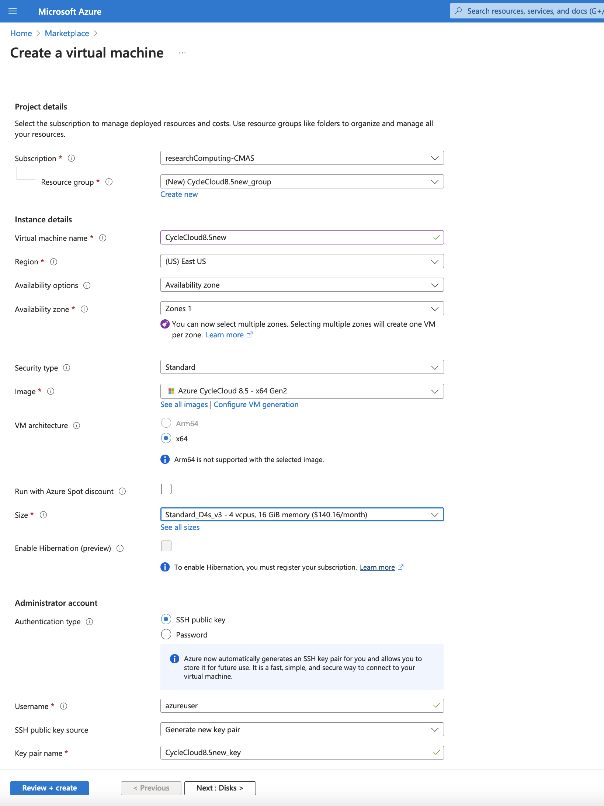

Figure 2. Select Disks for the Azure Virtual Machine - use default options

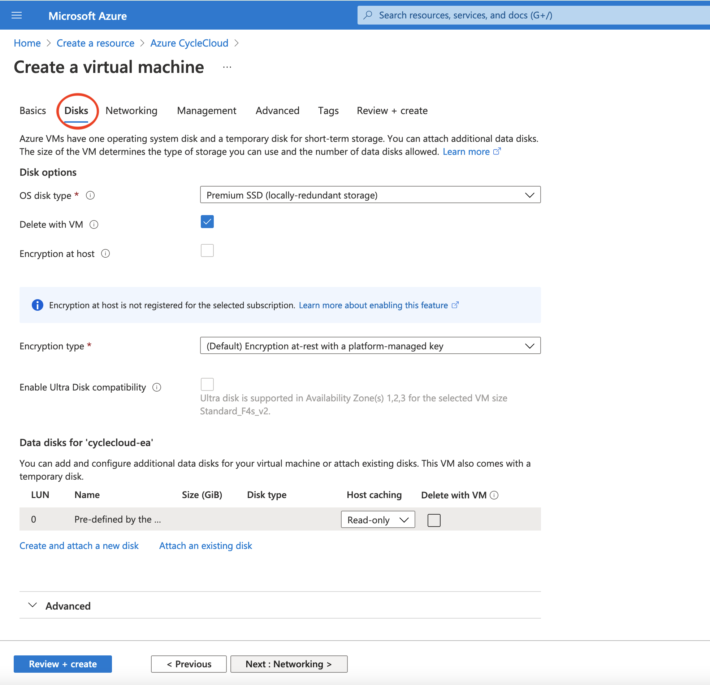

Figure 3. Select Network Interface for the Azure Virtual Machine - use default options

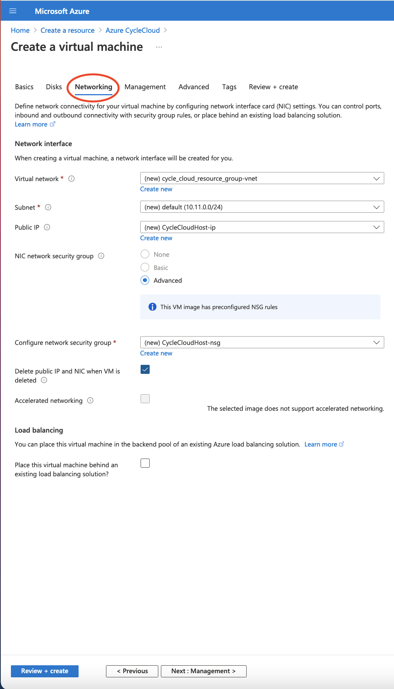

Figure 4. Select System assigned Managed Identity

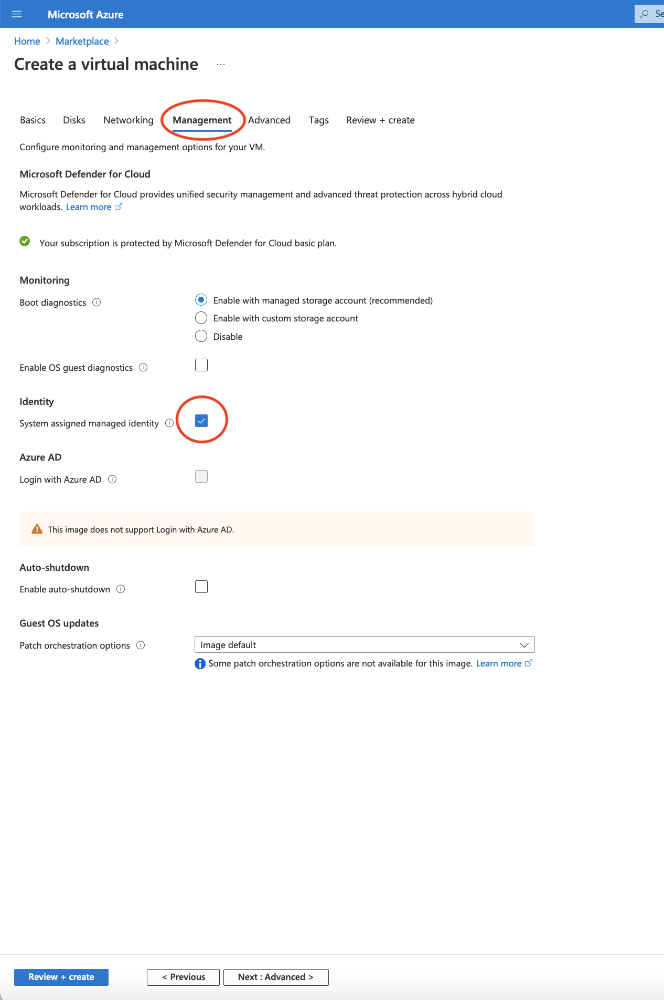


Figure 5. Create a Virtual Machine - Deployment is in Progress

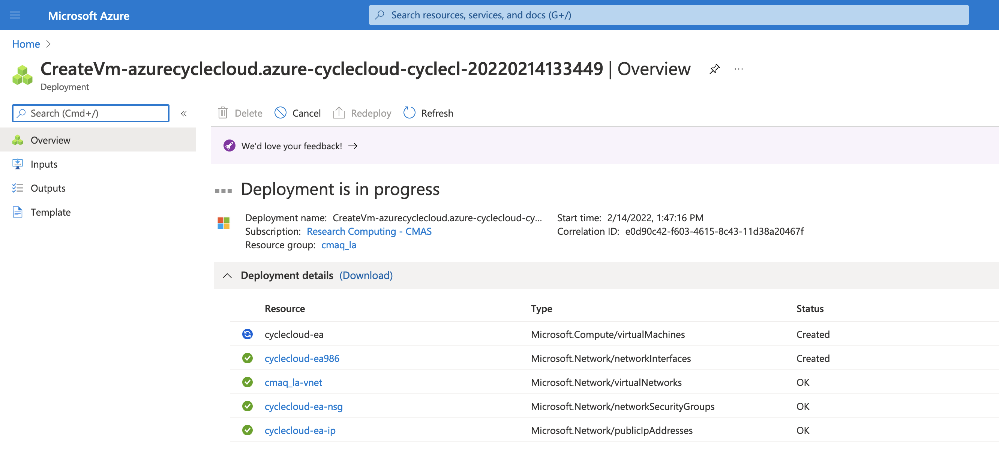


Figure 6. Your Deployment is complete - click on blue button `Go to resource`

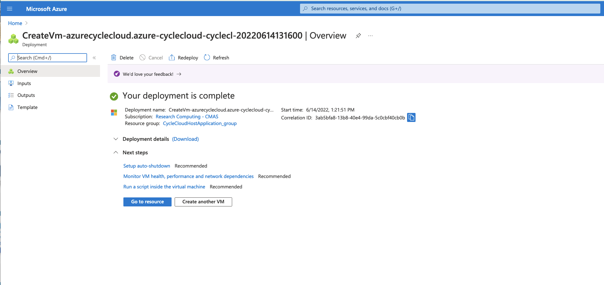

After the CycleCloud Host Machine has been deployed click on `Go to resource`

Add Contributor Role to Virtual Machine - 

Figure 7. Click on Identity Icon on left side of CycleCloudHost Application Virtual Machine

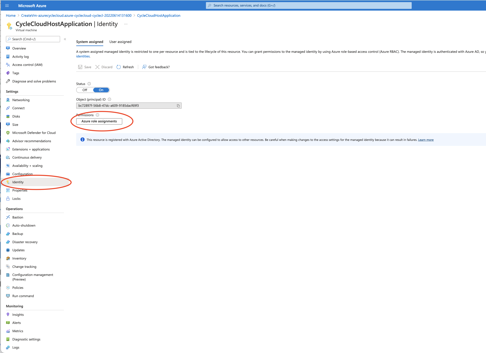

Click on the Identity Menu on the left side of the newly created virtual machine.
Make sure you select the System Assigned Tab at the top of the window.
Click on the button `Azure Role Assignments`

Figure 8. Make sure you select the System Assigned Tab at the top of the window.

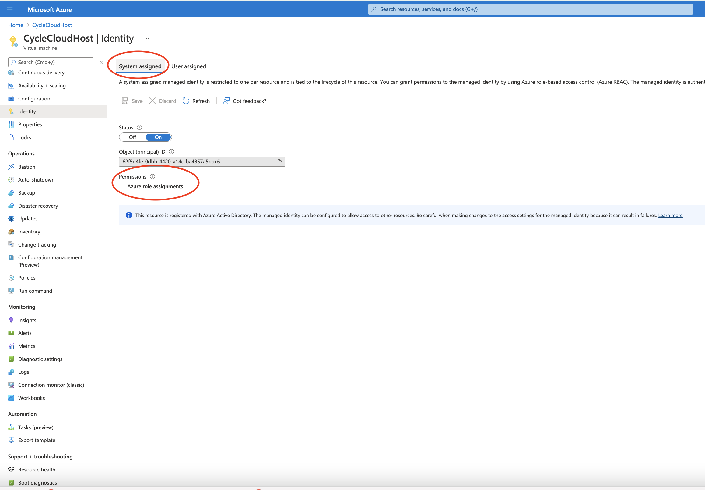

On the Azure role assignments window
click on the + Add role assignment(Preview)


Figure 9. Add System Assigned Role Assignment - Management Identity

Click on Azure role assignements
Search for Managed Identity Operator

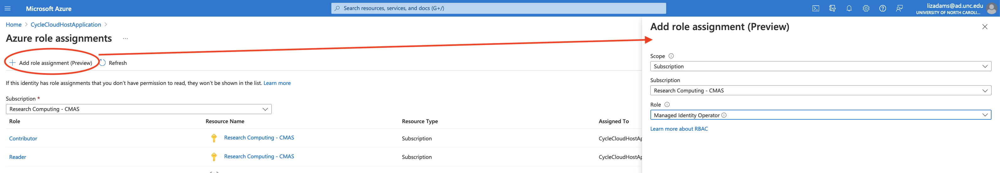


Figure 10. Add Role Assignment

1. Click Identity Icon under Settings on the left side menu 
2. Click Azure role assignments
3. Click Add role assignment  
4. Search for Contributor


Figure 11. Add Reader Role to Virtual Machine

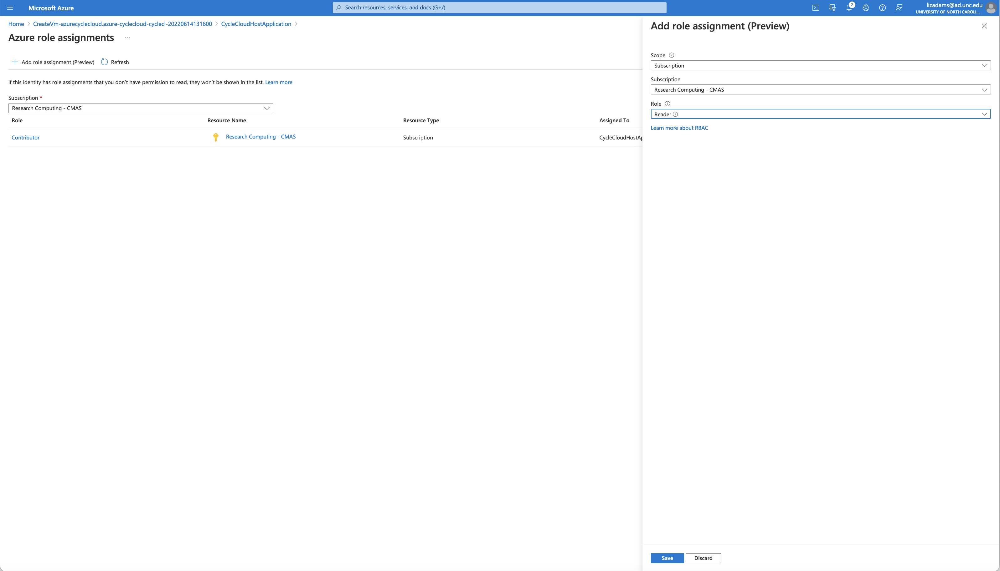


### Create Storage Account 

Question: Do I need to create a new storage account for each CycleCloud Virtual Machine Host?

In the search bar, enter Storage Account, the select + Create Storage Account

Select the resource group associated with the CycleCloudHost that you created CycleCloudHost_group
Select a lowercase name
Then switch from the Basics tab to the Advanced Tab
Uncheck the box next to Enable blob public access.
Click Review and Create
After the verification passed message is received
Click Create

Figure 12. Azure Create Storage Account Details

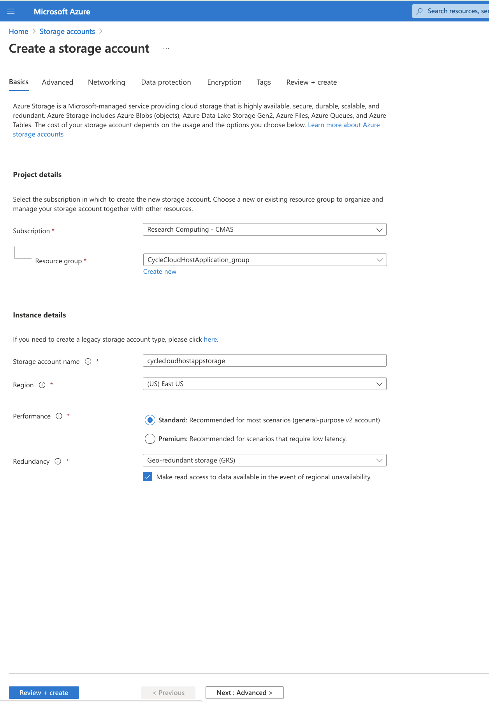

For Redundancy choose Local Redundant Storage instead of Geo-Redundant Storage to reduce costs.

Figure 13. Azure Storage Account disable Public Blob Access 

Disable the Public Blob Access by unclicking the box next to `Enable blob public access`

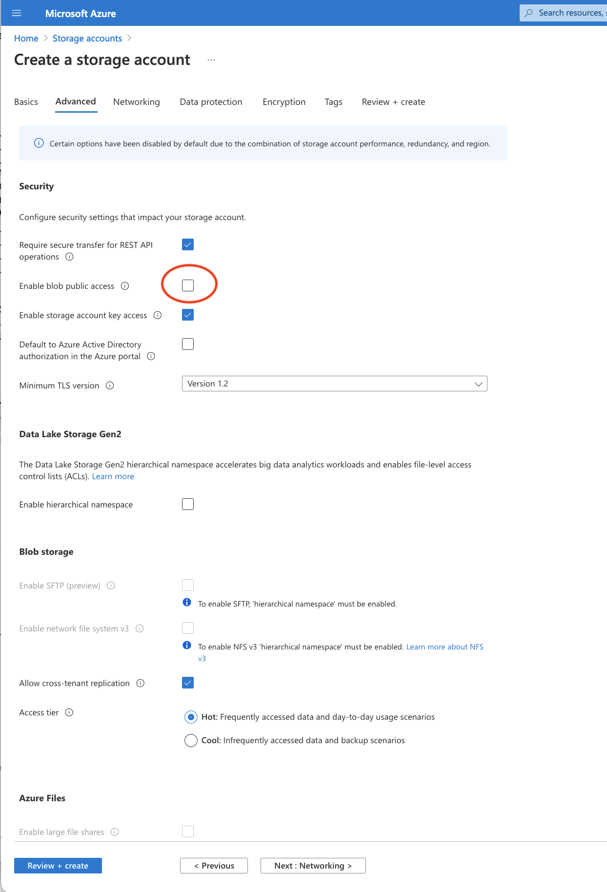

Figure 14. Storage Account Deployment is complete

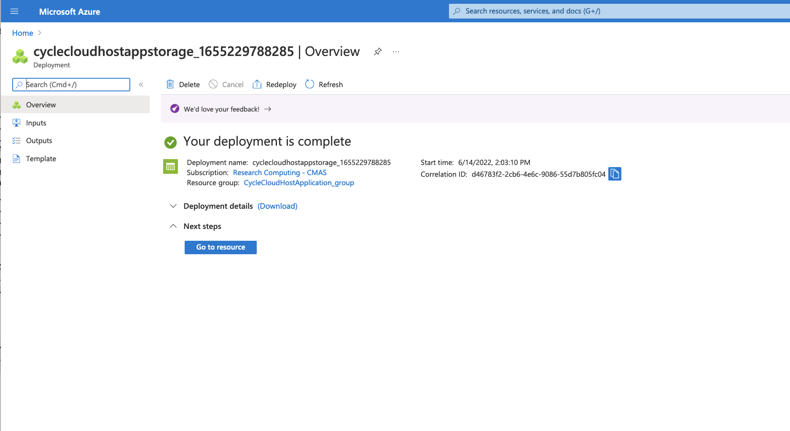


Click on Home to return to the Azure Portal and then Click on the CycleCloudHostApplication Virtual Machine

Click on Copy next to the Public IP address to copy it.

Figure 15. Azure Cycle Cloud Host Machine IP address


## Connect to Cyclecloud Web Interface

In your web browser, create a new tab, and enter the IP address that you copied from the step above.

`https://-IP-ADDRESS/welcome`

If you get a warning, potential security risk ahead, click on Advanced, then accept risk and continue.

1. Enter a Site Name - a unique name for the CycleCloud. example CycleCloudHostApplicationManager


2. Read and click that you agree to the CycleCloud Software License Agreement


3. Create your CycleCloud Administrator Account. This requires a public rsa key. <a href="https://docs.microsoft.com/en-us/azure/virtual-machines/linux/mac-create-ssh-keys">Instructions for creating this are available here</a>

Figure 16. Web Interface to CycleCloud - connect using the ip address for the Scheduler Node above http://-IP-ADDRESS/welcome


Figure 17. Azure CycleCloud Add Subscription ID
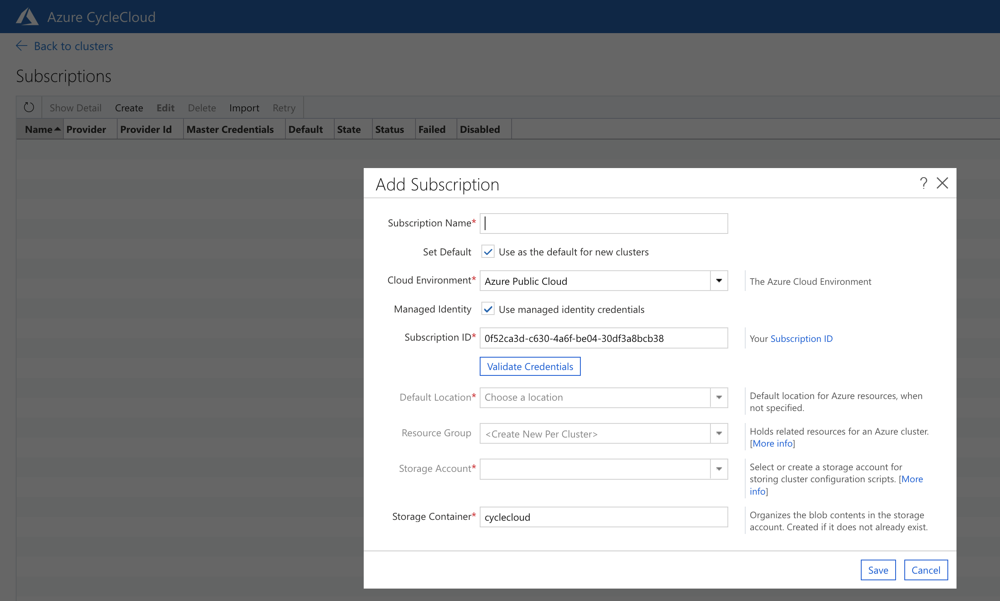

The Subscriptions page will show if the cluster subscription was created. You may need to pull the State window to enlarge it.

When it says created, with nothing under the Failed column, then it was successful, click Back to Clusters.

Figure 18. Check Cluster Creation Status in Subsriptions Table

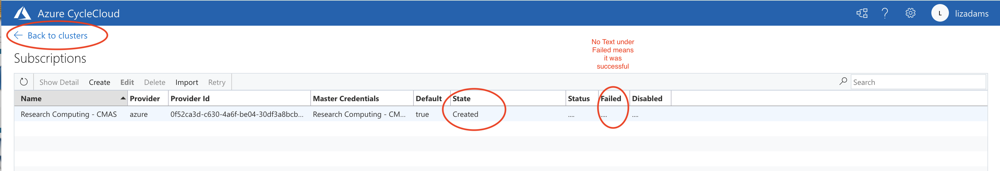

Figure 19. Azure CycleCloud Create a New Cluster - Select SLURM workload Manager

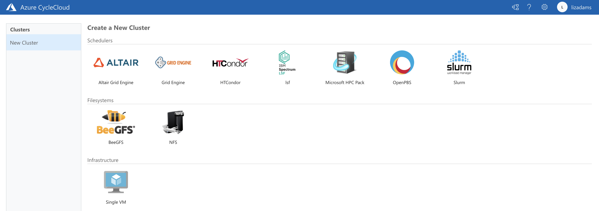

Figure 20. Azure CycleCloud New Slurm Cluster - add a Cluster Name

Example name: CMAQSlurmHC44rsAlmaLinux

Figure 21.  Azure CycleCloud HPC Queue Select Machine

In the Min Cores box, input 44
In the Compute Type, select High Performance Compute
Select HC44rs, then select Apply


Figure 22. Select Max HPC Cores

Select Auto-Scaling Max HPC Cores to be a multiple of the number of cpus available on the compute node.  For HC44rs for a maximum of 5 nodes, it would be 44 x 5 = 220 Max HPC Cores
Choose the Networking SubnetID that was created for the CycleCloud.


Figure 23.  Azure CycleCloud Network Attached Storage

Change the size from 100 GB of network attached storage to 1000 GB of network attached storage for the /shared directory, where CMAQ and the input data will be installed.


Figure 24.  Azure CycleCloud Select OS and Uncheck Name as HostName

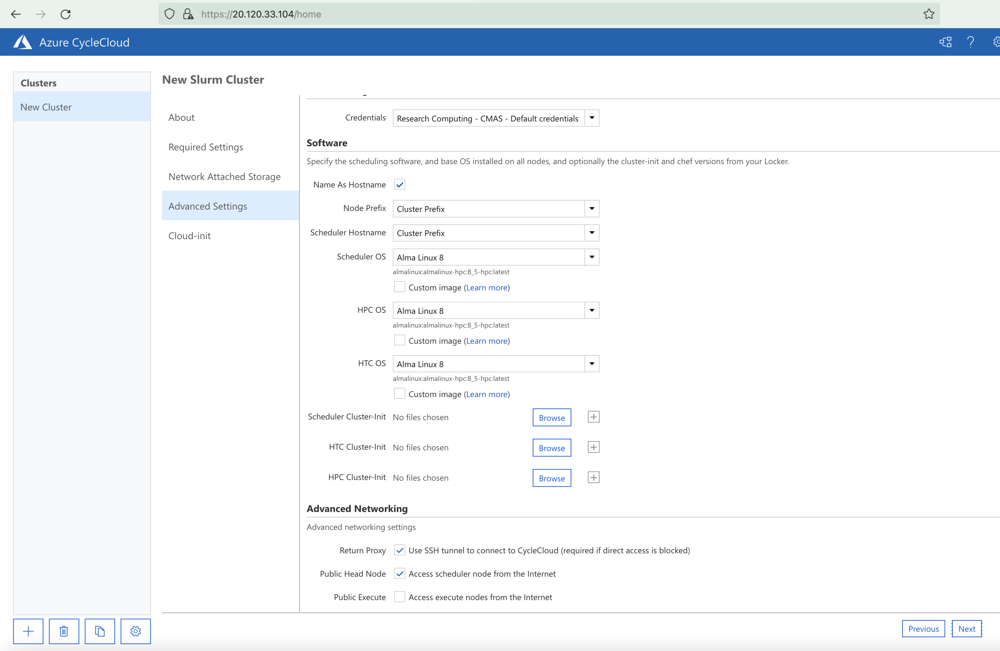


Figure 25. Azure CycleCloud Select Machine Type for HPC Node

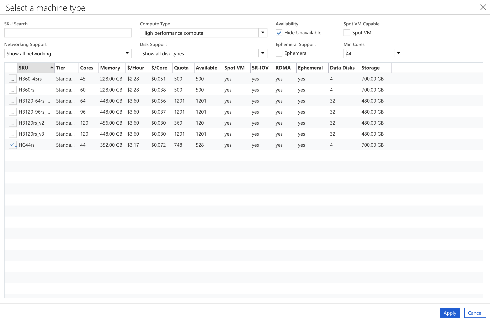

Figure 26. Azure Cycle Cloud Required Settings HPC VM Select HC44rs

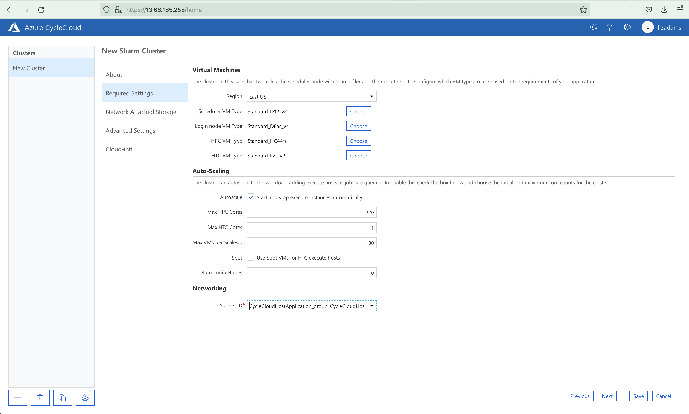

Note: the maximum number of CPUs specified for the HPC Compute node can be changed after the cluster has been created. See section 4.1.4 for the command line commands.

Figure 27. Azure Cycle Cloud Subscriptions Registering Service Providers

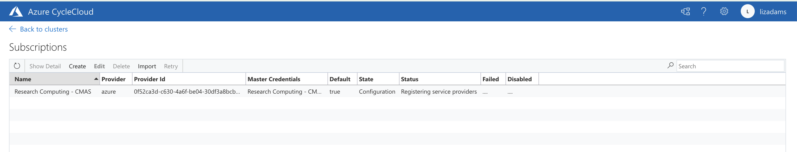

Figure 28. Azure cycle Cloud Subscription Created Successsfully


Figure 29. Azure cycle cloud Nodes Tab Shows Status of Scheduler

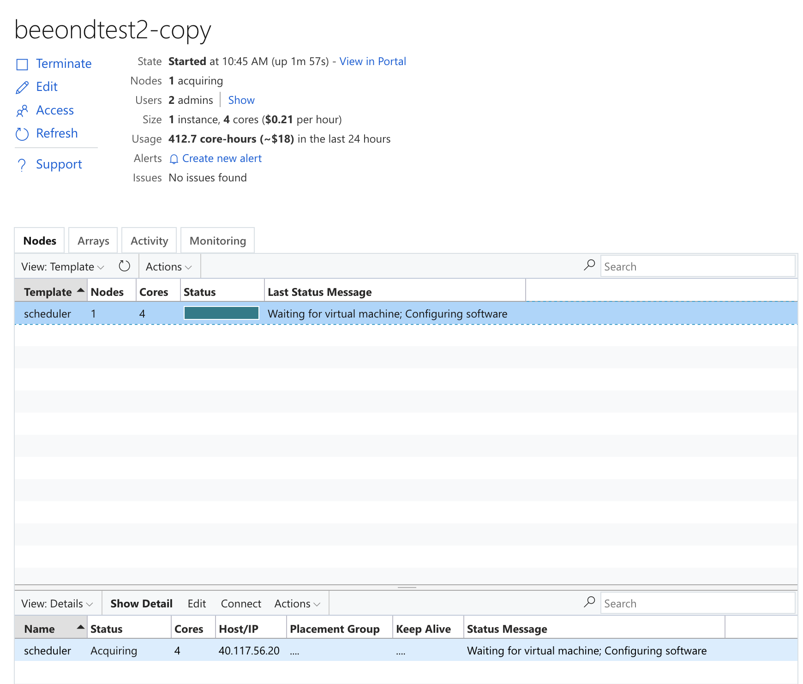


Figure 30. Azure Cycle Cloud Cluster Arrays Tab Shows HPC Queue Machine Type

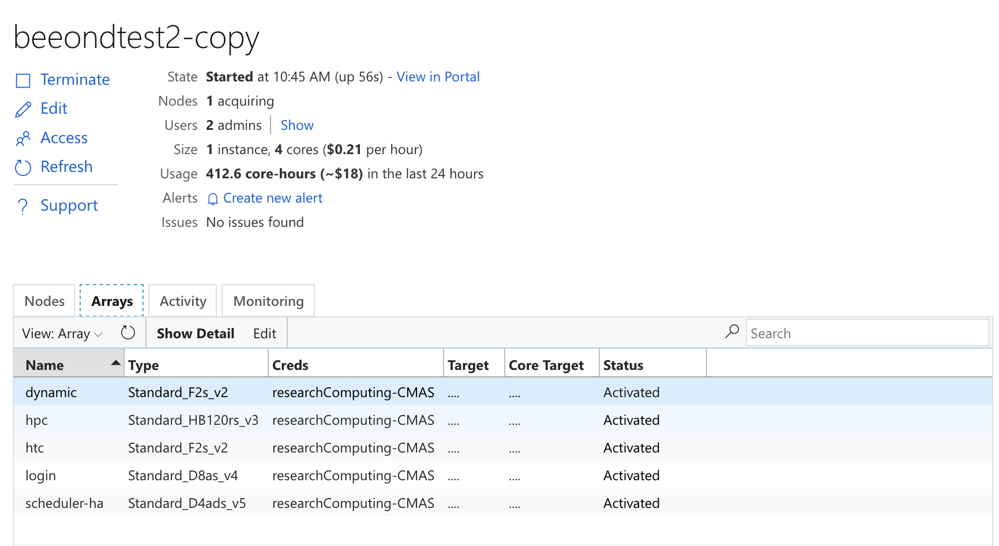


Azure Cycle Cloud Start Cluster
In the Nodes table, it will say 
scheduler 1 node, 4 cores, Status Message: Staging Resources

Login to Azure Cycle Cloud and verify that the following command works.

Click on the Scheduler node, and obtain the IP address, then login using

ssh -Y azureuser@IP-ADDRESS

Run a bash script for 1 minute by submitting to the hpc node using srun.

`srun -t 1:00  -n 2  --pty /bin/bash`

You should see the hpc acquiring a single node.

Figure 31. Azure CycleCloud Acquiring Compute Node after running srun command.

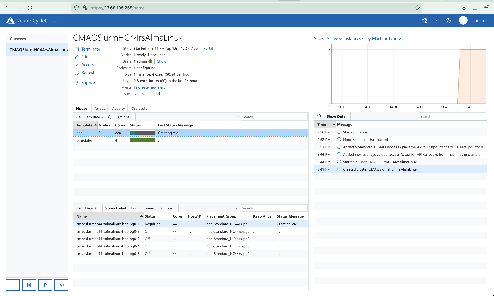

After the compute node is created and the srun command is completed, the compute node will be shut down automatically, after it has been idle for a period of time.

You can use the slurm commands to monitor the status of the compute nodes.

`qstat`

```
Job id              Name             Username        Time Use S Queue          
------------------- ---------------- --------------- -------- - ---------------
2                   bash             lizadams        00:00:05 R hpc            
```

for additional detail:

`qstat -f`

Output:

```
Job Id:	2
	Job_Name = bash
	Job_Owner = lizadams@CMAQSlurmHC44rsAlmaLinux-scheduler
	interactive = True
	job_state = R
	queue = hpc
	qtime = Tue Jun 14 18:56:17 2022
	mtime = Tue Jun 14 19:04:13 2022
	ctime = Tue Jun 14 20:34:13 2022
	exec_host = cmaqslurmhc44rsalmalinux-hpc-pg0-1/2
	Priority = 4294901759
	euser = lizadams(20001)
	egroup = lizadams(20001)
	Resource_List.walltime = 01:30:00
	Resource_List.nodect = 1
	Resource_List.ncpus = 2
```

Figure 32. Azure Cycle Cloud Showing usage of Scheduler Node and Compute Nodes for Srun command

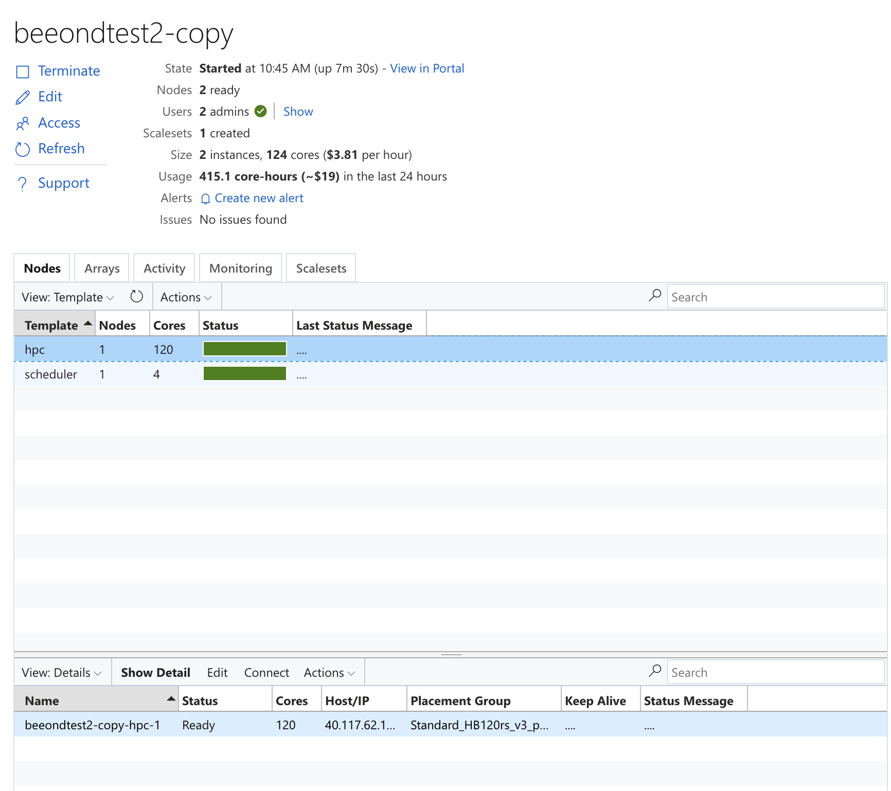


## Instructions to upgrade the number of processors available to the Cycle Cloud Cluster (only needed if you want to modify the number of nodes in the HPC queue)

Edit the HPC config in the cyclecloud web interface to set the CPUs to 480 
Run the following on the scheduler node the changes should get picked up:

`cd /opt/cycle/slurm`

`sudo ./cyclecloud_slurm.sh scale`
