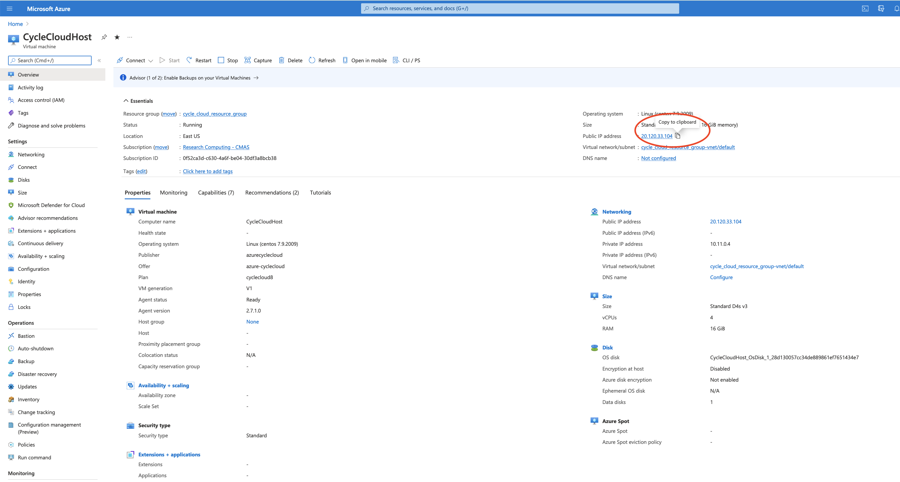
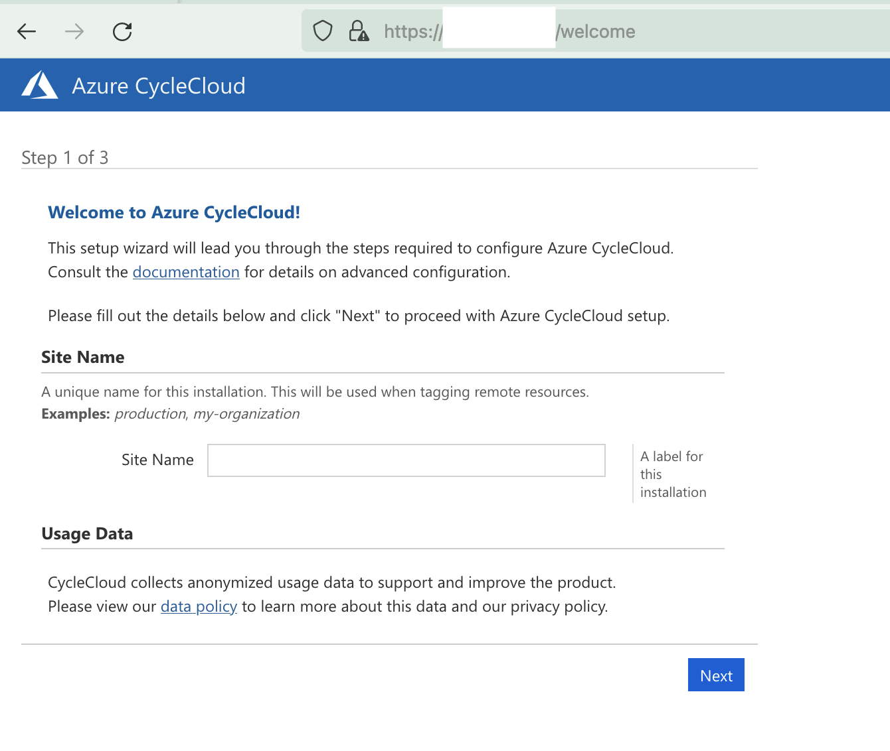
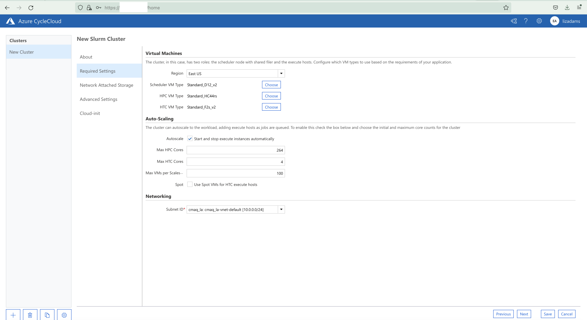

# Create Cyclecloud CMAQ Cluster

Documentation for Azure
<a href="https://docs.microsoft.com/en-us/azure/cyclecloud/?view=cyclecloud-8">CycleCloud Documentation</a>

## Configure the Cycle Cloud Cluster using the Azure Portal

Log into the [Azure Portal](https://ms.portal.azure.com/)

In the search bar, enter "Marketplace", Click on Marketplace Icon.

In the Marketplace search bar, enter "CycleCloud".

Click on the heart in the Azure CycleCloud box to add this as a favorite resource.

Use the Create pulldown menu to select `Azure CycleCloud 8.2` 

## Customize Host Virtual Machine for CycleCloud

1. Choose your Subscription
2. Select or create a new Resource Group that your CycleCloud instance will run in
3. Name your CycleCloud instance using Virtual Machine name 
4. Select Region
5. Verify Image is Azure CycleCloud 8.2 - Gen 1
6. Select Size, click on see all sizes, enter D4s into the search button and select Standard_D4s_v3- 4cpus, 16GiB memory ($140.16/month)
7. Select Authentication Type `SSH public key`
5. Create the Username that you will use to log into the instance
6. SSH public key source - select `Generate new key pair`
7. Select the Management tab and enable `System assigned managed identity`
8. Click on the `Review` button and then the `Create` button

Figure 1. Create a virtual Machine - Customize Host Virtual Machine
Note: this virtual machine will be used to create the Cycle Cloud Cluster from it's Web located at: UI https://IP-address/home

Figure 2. Select Disks for the Azure Virtual Machine - use default options

Figure 3. Select Network Interface for the Azure Virtual Machine - use default options

Figure 4. Select System assigned Managed Identity

Figure 5. Create a Virtual Machine

Next, add Contributor Role to Virtual Machine

Click on the Identity Menu on the left side of the newly created virtual machine.
Make sure you select the System Assigned Tab at the top of the window.
Click on the button `Azure Role Assignments`
For the following figures, additional instructions are needed, as it is unclear where users go to add the contributor role. 

Figure 6. Add Contributor Role to Virtual Machine

Figure 7. Add Role Assignment - Management Identity

Figure 8. Add Role Assignment

1. Click Identity Icon under Settings on the left side menu 
2. Click Azure role assignments
3. Click Add role assignment  

Note, many of the screen shots below don't show how to get to that menu. When I tried to reproduce these steps, I was getting permission issues.

Figure 9. Add Reader Role to Virtual Machine

Figure 10. Review Reader Role on Virtual Machine

Figure 11. Azure Create Storage Account

Figure 12. Azure Create Storage Account Details

Figure 13. Azure Review Storate Account Details

## Click Go to Resoure after the deployment is complete.

Click on Copy next to the Public IP address to copy it.

## Connect to Cyclecloud Web Interface

In your web browser, create a new tab, and enter the IP address that you copied from the step above.

`https://-IP-ADDRESS/welcome`

1. Enter a Site Name - a unique name for the CycleCloud.

CycleCloudCMAQ

2. Read and click that you agree to the CycleCloud Software License Agreement

3. Create your CycleCloud Administrator Account. Use the same username that you used for the scheduler node. 

Figure 14. Web Interface to CycleCloud - connect using the ip address for the Scheduler Node above http://-IP-ADDRESS/welcome

Figure 15. Azure CycleCloud Web Login

Figure 16. Azure CycleCloud Add Subscription

Figure 17. Azure CycleCloud Add Subscription and Validate Credentials

Figure 18. 
Azure CycleCloud HPC Queue Select Machine

Figure 19. 
Azure CycleCloud HPC VM Type Confirmed

Figure 20.
Azure CycleCloud Network Attached Storage

Figure 21.
Azure CycleCloud Select OS and Uncheck Name as HostName

Login to Azure Cycle Cloud and verify that the following command works.

'srun -t 1:30:00  -n --pty /bin/bash'

## Instructions to upgrade the number of processors available to the Cycle Cloud Cluster

Edit the HPC config in the cyclecloud web interface to set the CPUs to 480 
Run the following on the scheduler node the changes should get picked up:

`cd /opt/cycle/slurm`

`sudo ./cyclecloud_slurm.sh scale`
