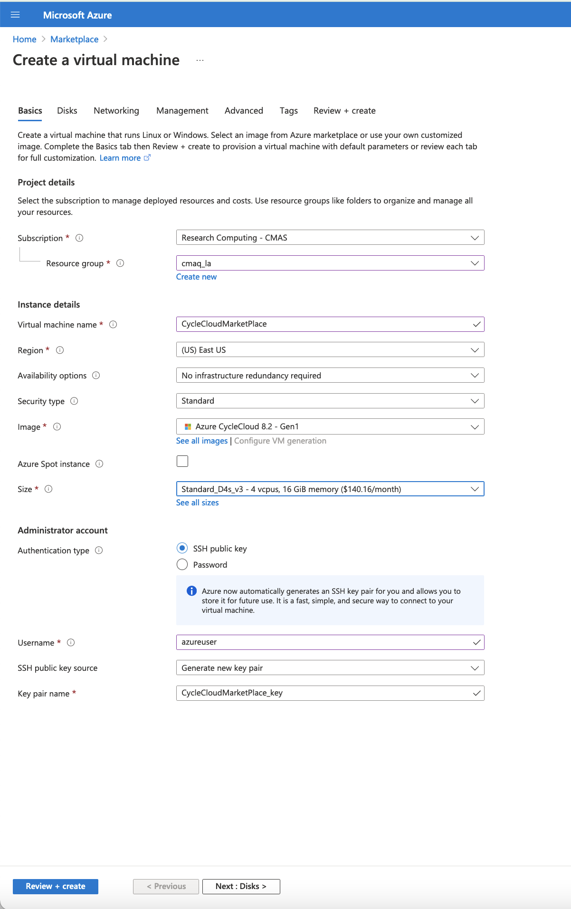
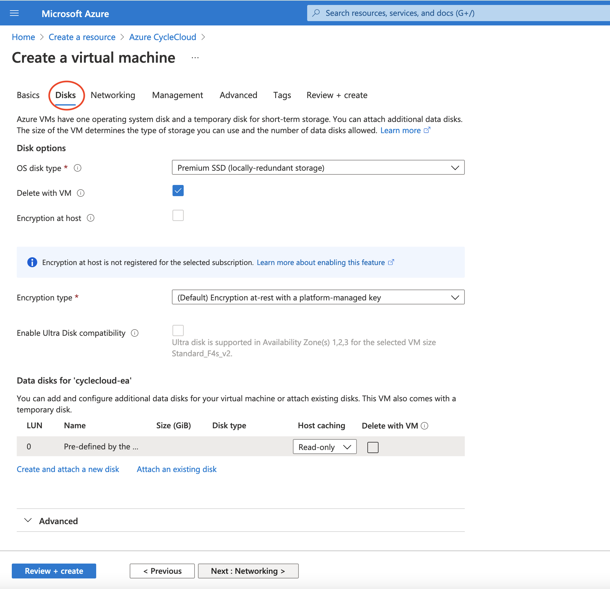
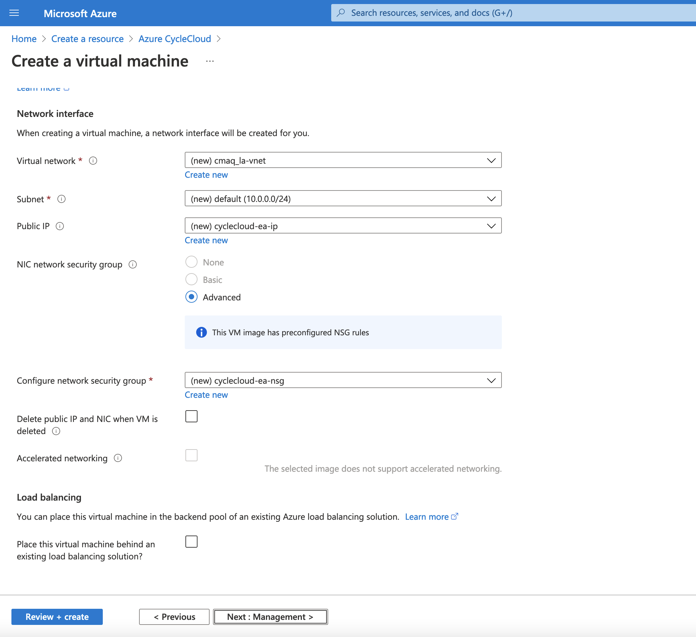
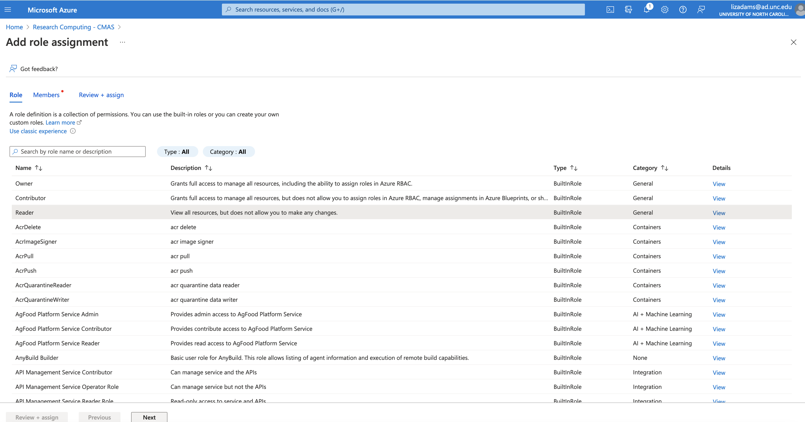
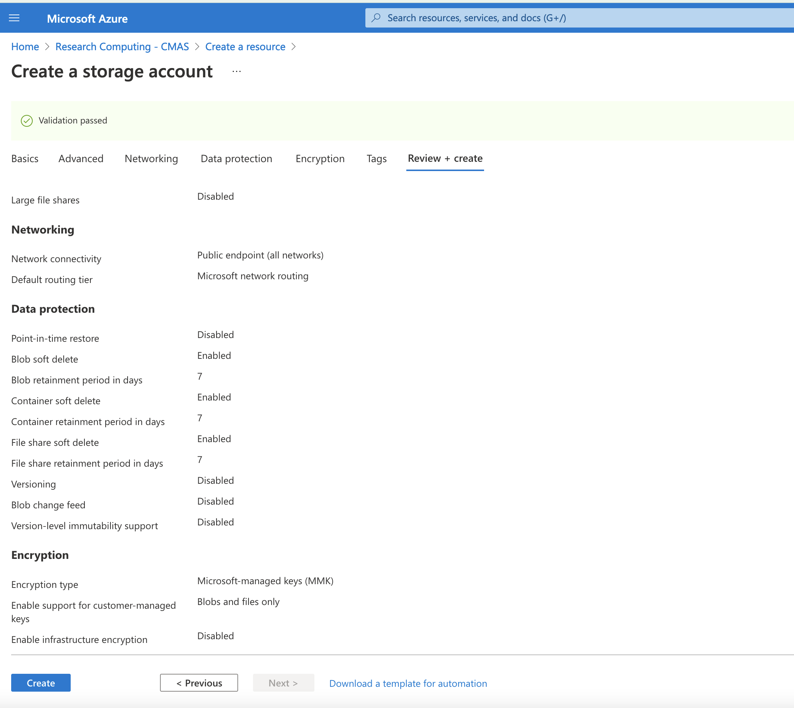
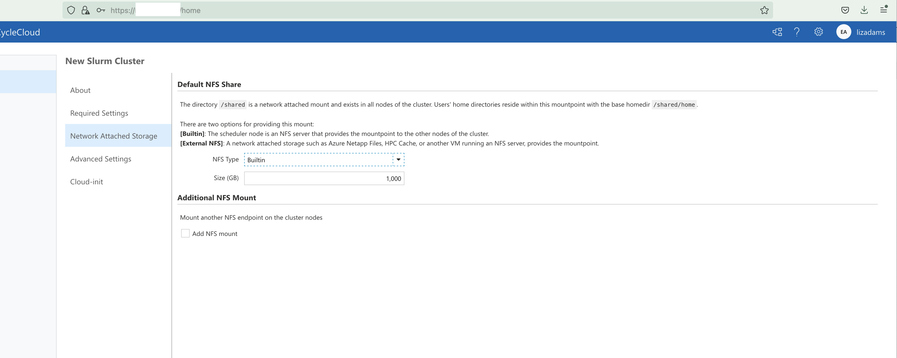

# Create Cyclecloud CMAQ Cluster

Documentation for Azure
<a href="https://docs.microsoft.com/en-us/azure/cyclecloud/?view=cyclecloud-8">CycleCloud Documentation</a>

## Configure the Cycle Cloud Cluster using the Azure Portal

Log into the [Azure Portal](https://ms.portal.azure.com/)

In the search bar, enter "Marketplace", Click on Marketplace Icon.

In the Marketplace search bar, enter "CycleCloud".

Click on the heart in the Azure CycleCloud box to add this as a favorite resource.

Use the Create pulldown menu to select `Azure CycleCloud 8.2` 

## Customize Scheduler node for CycleCloud

1. Choose your Subscription
2. Select or create a new Resource Group that your CycleCloud instance will run in
3. Name your CycleCloud instance using Virtual Machine name 
4. Select Region
5. Verify Image is Azure CycleCloud 8.2 - Gen 1
6. Select Size, click on see all sizes, enter D4s into the search button and select Standard_D4s_v3- 4cpus, 16GiB memory ($140.16/month)
7. Select Authentication Type `SSH public key`
5. Create the Username that you will use to log into the instance
6. SSH public key source - select `Generate new key pair`
7. Select the Management tab and enable `System assigned managed identity`
8. Click on the `Review` button and then the `Create` button

Create a virtual Machine - 
Note: this virtual machine will be used to create the Cycle Cloud Cluster from it's Web located at: UI https://IP-address/home

Select a VM Size of D4s_v3

Selects Disks for the Azure Virtual Machine

Selects Network Interface for the Azure Virtual Machine

Create Virtual Machine Management Identity

Create a Virtual Machine

Add Contributor Role to Virtual Machine
Click on the Identity Menu on the left side of the newly created virtual machine.
Make sure you select the System Assigned Tab at the top of the window.
Click on the button `Azure Role Assignments`

Click on the + Add Role Assignment

Add Role Assignment - Management Identity

Add Role Assignment

Add Reader Role to Virtual Machine

Review Reader Role on Virtual Machine

Azure Create Storage Account

Azure Create Storage Account Details

Azure Review Storate Account Details

Web Interface to CycleCloud - connect using the ip address for the virtual machine above http://-IP-ADDRESS/welcome

Azure CycleCloud Web Login

Azure CycleCloud Add Subscription

Azure CycleCloud Add Subscription and Validate Credentials

Azure CycleCloud HPC Queue Select Machine

Azure CycleCloud HPC VM Type Confirmed

Azure CycleCloud Network Attached Storage

Azure CycleCloud Select OS and Uncheck Name as HostName

Login to Azure Cycle Cloud and verify that the following command works.

'srun -t 1:30:00  -n --pty /bin/bash'

## Instructions to upgrade the number of processors available to the Cycle Cloud Cluster

Edit the HPC config in the cyclecloud web interface to set the CPUs to 480 
Run the following on the scheduler node the changes should get picked up:

`cd /opt/cycle/slurm`

`sudo ./cyclecloud_slurm.sh scale`
