## Quality Assurance Checks for Successful CMAQ Run on CycleCloud


### run m3diff to compare the output data for two runs that have different values for NPCOL

```
cd /shared/data/output
ls */*ACONC*
```
```
setenv AFILE output_CCTM_v533_gcc_2016_CONUS_10x18pe_remove_native_sleep/CCTM_ACONC_v533_gcc_2016_CONUS_10x18pe_remove_native_sleep_20151222.nc
setenv BFILE output_CCTM_v533_gcc_2016_CONUS_9x10pe_remove_native_sleep/CCTM_ACONC_v533_gcc_2016_CONUS_9x10pe_remove_native_sleep_20151222.nc
```

```
m3diff
```
hit return several times to accept the default options

```
grep A:B REPORT
```

Should see all zeros. There are some non-zero values.
It appears to have all zeros if the domain decomposition  is the same NPCOL, here, NPCOL differs (10 vs 16)
Did a test to determine if removing the compiler option -march=native would result in zero differences if NPCOL differs.
This seems to work on CycleCloud, but did not work on Parallel Cluster.

Verify that you have loaded the gcc and openmpi modules.

`module avail`

`module load gcc-9.2.0`

`module load mpi/openmpi-4.1.0`

Verfiy the compiler version:

`gcc --version`

Output

```
gcc (GCC) 9.2.0
```

Comparison of the Makefiles on Cyclecloud:

`cd /shared/build/openmpi_gcc/CMAQ_v533/CCTM/scripts`

`diff BLD_CCTM_v533_gcc/Makefile BLD_CCTM_v533_gcc_remove_native/Makefile`

Output:

```
36c36
<  FSTD = -O3 -funroll-loops -finit-character=32 -Wtabs -Wsurprising -march=native -ftree-vectorize  -ftree-loop-if-convert -finline-limit=512
---
>  FSTD = -O3 -funroll-loops -finit-character=32 -Wtabs -Wsurprising -ftree-vectorize  -ftree-loop-if-convert -finline-limit=512
```


```
NPCOL  =  10; @ NPROW = 18
NPCOL  =  9; @ NPROW = 10
```

```
grep A:B REPORT
```

output

```
 A:B  0.00000E+00@(  1,  0, 0)  0.00000E+00@(  1,  0, 0)  0.00000E+00  0.00000E+00
 A:B  0.00000E+00@(  1,  0, 0)  0.00000E+00@(  1,  0, 0)  0.00000E+00  0.00000E+00
 A:B  0.00000E+00@(  1,  0, 0)  0.00000E+00@(  1,  0, 0)  0.00000E+00  0.00000E+00
 A:B  0.00000E+00@(  1,  0, 0)  0.00000E+00@(  1,  0, 0)  0.00000E+00  0.00000E+00
 A:B  0.00000E+00@(  1,  0, 0)  0.00000E+00@(  1,  0, 0)  0.00000E+00  0.00000E+00
 A:B  0.00000E+00@(  1,  0, 0)  0.00000E+00@(  1,  0, 0)  0.00000E+00  0.00000E+00
 A:B  0.00000E+00@(  1,  0, 0)  0.00000E+00@(  1,  0, 0)  0.00000E+00  0.00000E+00
 A:B  0.00000E+00@(  1,  0, 0)  0.00000E+00@(  1,  0, 0)  0.00000E+00  0.00000E+00
 A:B  0.00000E+00@(  1,  0, 0)  0.00000E+00@(  1,  0, 0)  0.00000E+00  0.00000E+00
 A:B  0.00000E+00@(  1,  0, 0)  0.00000E+00@(  1,  0, 0)  0.00000E+00  0.00000E+00
 A:B  0.00000E+00@(  1,  0, 0)  0.00000E+00@(  1,  0, 0)  0.00000E+00  0.00000E+00
 A:B  0.00000E+00@(  1,  0, 0)  0.00000E+00@(  1,  0, 0)  0.00000E+00  0.00000E+00
 A:B  0.00000E+00@(  1,  0, 0)  0.00000E+00@(  1,  0, 0)  0.00000E+00  0.00000E+00
 A:B  0.00000E+00@(  1,  0, 0)  0.00000E+00@(  1,  0, 0)  0.00000E+00  0.00000E+00
 A:B  0.00000E+00@(  1,  0, 0)  0.00000E+00@(  1,  0, 0)  0.00000E+00  0.00000E+00
 A:B  0.00000E+00@(  1,  0, 0)  0.00000E+00@(  1,  0, 0)  0.00000E+00  0.00000E+00
 A:B  0.00000E+00@(  1,  0, 0)  0.00000E+00@(  1,  0, 0)  0.00000E+00  0.00000E+00
 A:B  0.00000E+00@(  1,  0, 0)  0.00000E+00@(  1,  0, 0)  0.00000E+00  0.00000E+00
 A:B  0.00000E+00@(  1,  0, 0)  0.00000E+00@(  1,  0, 0)  0.00000E+00  0.00000E+00
 A:B  0.00000E+00@(  1,  0, 0)  0.00000E+00@(  1,  0, 0)  0.00000E+00  0.00000E+00
 A:B  0.00000E+00@(  1,  0, 0)  0.00000E+00@(  1,  0, 0)  0.00000E+00  0.00000E+00
 A:B  0.00000E+00@(  1,  0, 0)  0.00000E+00@(  1,  0, 0)  0.00000E+00  0.00000E+00
 A:B  0.00000E+00@(  1,  0, 0)  0.00000E+00@(  1,  0, 0)  0.00000E+00  0.00000E+00

```

### Use m3diff to compare two runs that have different NPCOL but were compiled with -march=native

```
setenv AFILE output_CCTM_v533_gcc_2016_CONUS_10x18pe/CCTM_ACONC_v533_gcc_2016_CONUS_10x18pe_20151222.nc
setenv BFILE output_CCTM_v533_gcc_2016_CONUS_12x20pe/CCTM_ACONC_v533_gcc_2016_CONUS_12x20pe_20151222.nc
m3diff
```

```
grep A:B REPORT
```

```
NPCOL  =  10; @ NPROW = 18
NPCOL  =  12; @ NPROW = 20
```


Resulted in differences in the output

```
 A:B  1.39698E-09@(280, 83, 1) -1.16415E-10@( 58,208, 1)  1.79255E-14  4.74000E-12
 A:B  2.79397E-09@(320,150, 1) -3.72529E-09@(300,145, 1) -2.61413E-16  2.41309E-11
 A:B  3.72529E-09@(292,140, 1) -5.58794E-09@(273,157, 1) -1.07441E-13  9.05464E-11
 A:B  1.27475E-08@(246, 60, 1) -1.44355E-08@(353,166, 1)  1.10951E-13  2.19638E-10
 A:B  5.12227E-08@(322,183, 1) -9.73232E-08@(384,201, 1) -4.47347E-12  9.37281E-10
 A:B  2.44007E-07@(383,201, 1) -1.62516E-07@(357,171, 1) -1.39055E-11  2.33763E-09
 A:B  2.99886E-07@(291,150, 1) -2.14204E-07@(321,183, 1) -1.30589E-11  3.38753E-09
 A:B  4.89876E-07@(316,190, 1) -2.59839E-07@(368,178, 1)  1.53742E-11  5.59802E-09
 A:B  5.34113E-07@(281,157, 1) -3.59956E-07@(293,156, 1)  2.77145E-11  7.09438E-09
 A:B  5.22472E-07@(317,190, 1) -4.34928E-07@(293,157, 1)  1.76922E-11  8.39259E-09
 A:B  4.05125E-06@(295,160, 1) -5.04777E-07@(317,184, 1)  4.79654E-11  1.63639E-08
 A:B  7.26432E-07@(308,159, 1) -1.67079E-06@(295,160, 1)  1.09544E-11  1.36729E-08
 A:B  7.61822E-07@(262,167, 1) -2.97464E-06@(295,161, 1) -5.31256E-11  1.96557E-08
 A:B  1.52830E-06@(252,170, 1) -2.21282E-06@(339,201, 1) -1.21567E-12  2.49501E-08
 A:B  2.96161E-06@(296,160, 1) -2.02283E-06@(300,169, 1)  1.20804E-10  3.65410E-08
 A:B  2.82843E-06@(132, 98, 1) -1.64099E-06@(134, 98, 1)  2.63695E-10  3.76774E-08
 A:B  1.87941E-06@(310,163, 1) -1.13249E-06@(279,167, 1) -2.02132E-10  3.36560E-08
 A:B  2.50991E-06@(349,206, 1) -1.35228E-06@(297,165, 1) -1.04908E-10  3.62385E-08
 A:B  1.50874E-06@(348,204, 1) -3.92273E-06@(298,165, 1) -1.10150E-10  3.89420E-08
 A:B  3.27453E-06@(352,208, 1) -6.02473E-06@(259,178, 1) -4.80990E-10  4.45810E-08
 A:B  2.69525E-06@(259,182, 1) -4.68642E-06@(259,179, 1) -3.80682E-10  4.53800E-08
 A:B  2.86289E-06@(259,182, 1) -4.98630E-06@(259,180, 1) -7.44821E-11  4.62413E-08
 A:B  2.29664E-06@(354,208, 1) -3.09758E-06@(259,181, 1) -2.24090E-10  4.51584E-08
 A:B  1.93343E-06@(354,208, 1) -1.84402E-06@(309,158, 1) -2.71079E-10  4.94183E-08
```


### Run the following R script to create box plots and spatial plots showing difference between two CMAQ runs. 

Note: requires that the R scripts and packages. See earlier instructions. 

edit the R script to specify the sim1.dir, sim1.file  and sim2.dir, sim2.file to correspond to the Benchmark cases that have been run.


Then run the R scripts!

```
cd /shared/cyclecloud-cmaq/qa_scripts
Rscript compare_EQUATES_benchmark_output_CMAS_cyclecloud.r
```

View the Operating System

`cat /etc/os-release`

Output:

```
NAME="CentOS Linux"
VERSION="7 (Core)"
ID="centos"
ID_LIKE="rhel fedora"
VERSION_ID="7"
PRETTY_NAME="CentOS Linux 7 (Core)"
ANSI_COLOR="0;31"
CPE_NAME="cpe:/o:centos:centos:7"
HOME_URL="https://www.centos.org/"
BUG_REPORT_URL="https://bugs.centos.org/"

CENTOS_MANTISBT_PROJECT="CentOS-7"
CENTOS_MANTISBT_PROJECT_VERSION="7"
REDHAT_SUPPORT_PRODUCT="centos"
REDHAT_SUPPORT_PRODUCT_VERSION="7"
```

To view the script, install imagemagick


```
sudo yum groupinstall "Development Tools" -y
sudo yum install ImageMagick
sudo yum install ImageMagick-devel
```

Make sure that you have Xquartz running on your local machine, and that you have given permission to display back from the cyclecloud server.

On your local terminal:
`host +`

Example output plots are available for the CONUS Benchmark in the following directory

When NPCOL is fixed, we are seeing no difference in the answers.

Example comparison of 10x18 compared to 9x10 with the -march=native compiler flag removed

Box Plot for ANO3J when -march=native compiler flag is removed 

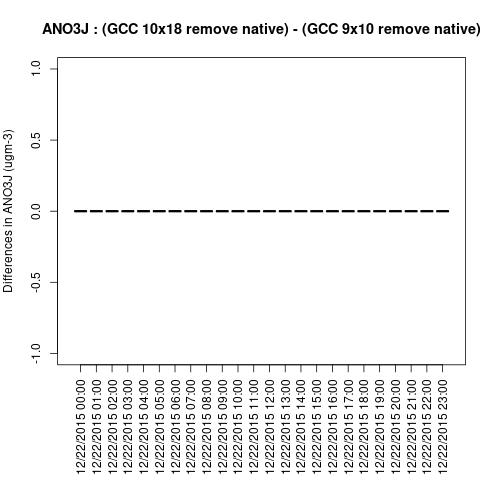


Box plot shows no difference between ACONC output for a CMAQv5.3.3 run using different PE configurations as long as NPCOL is fixed (this is true for all species that were plotted (AOTHRJ, CO, NH3, NO2, O3, OH, SO2), or when not using march=native in the compiler flag


Box plot shows a difference betweeen ACONC output for a CMAQv5.3.3 run using different PE configurations when NPCOL is different, if march=native option is used

ANO3J


AOTHRJ

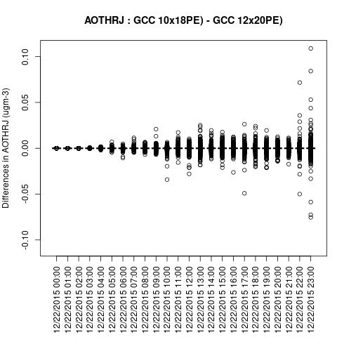

CO

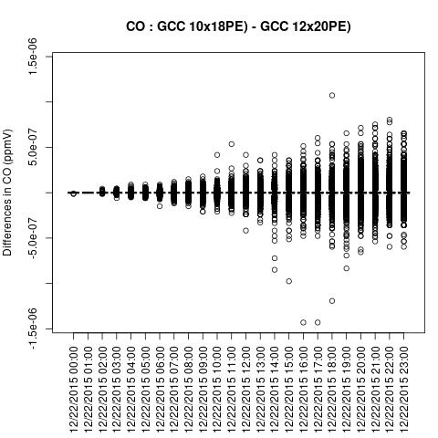

NH3

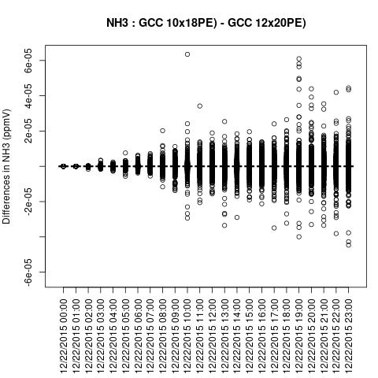

NO2

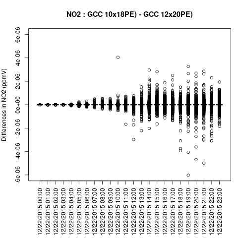

O3

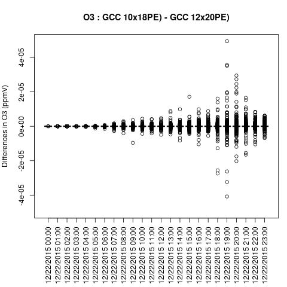

OH

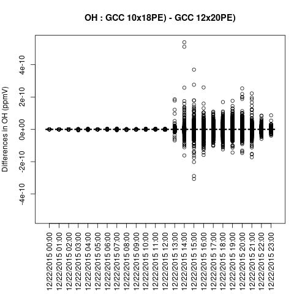

SO2

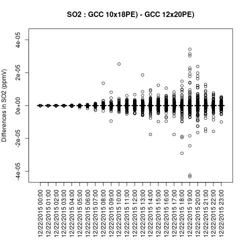


Spatial Plot for when NPCOL is different and when -march=native compiler flag is used

ANO3J

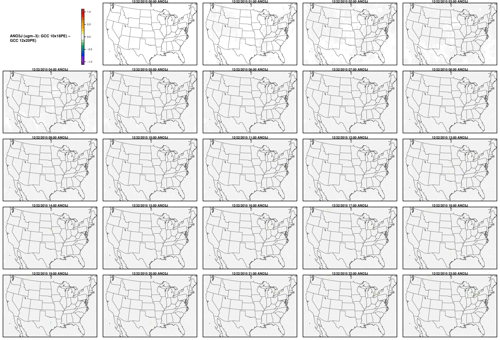

AOTHRJ


CO

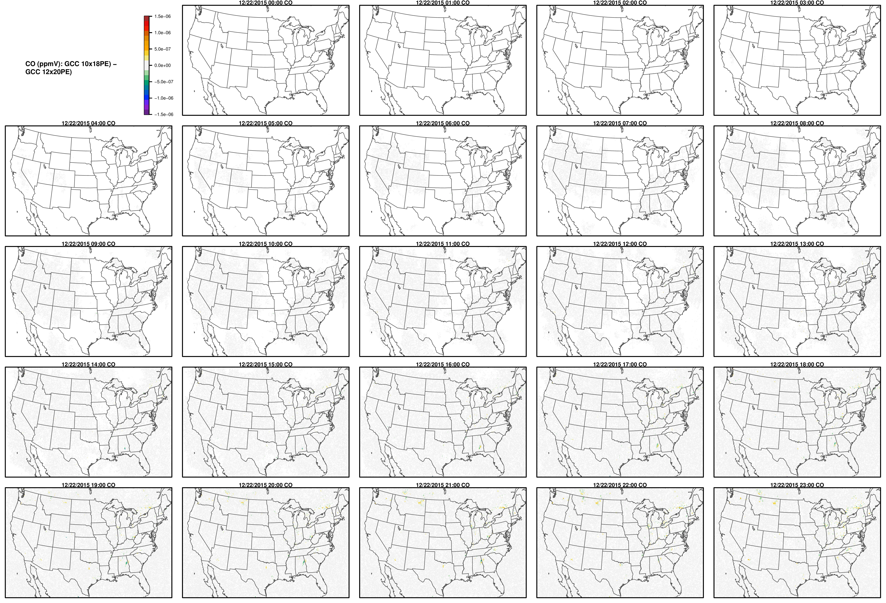

NH3

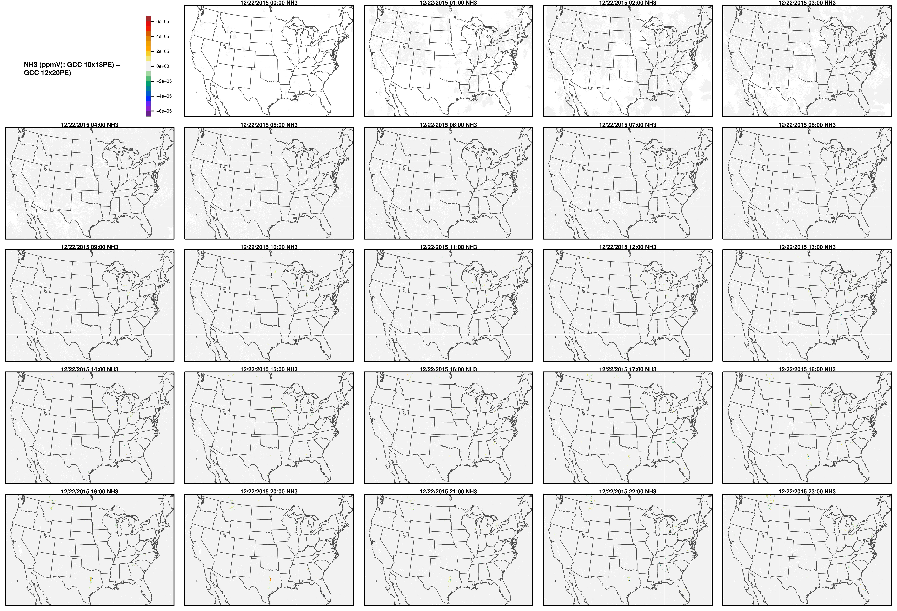


NO2

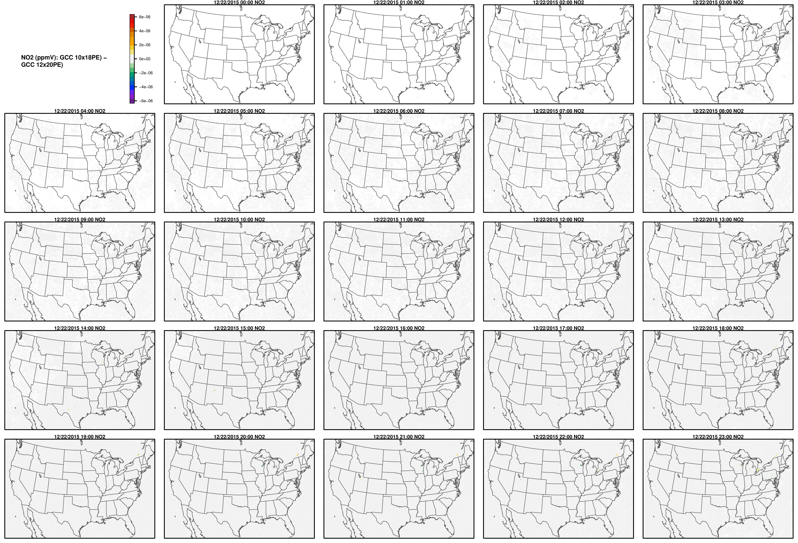

O3

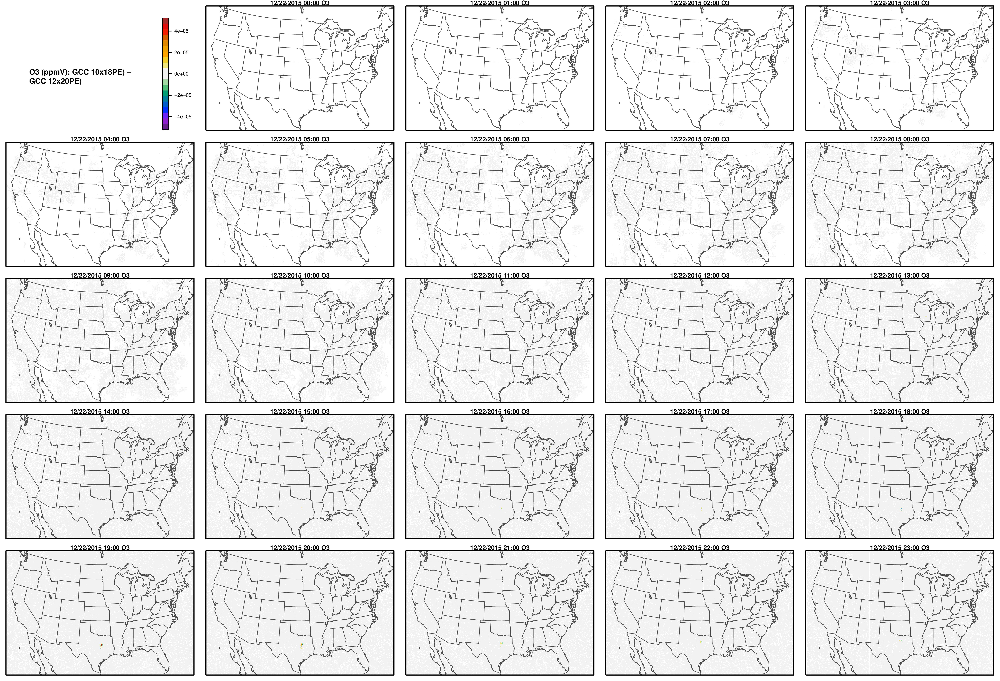

OH


SO2

