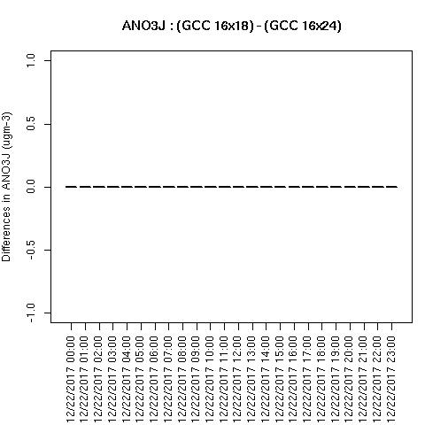
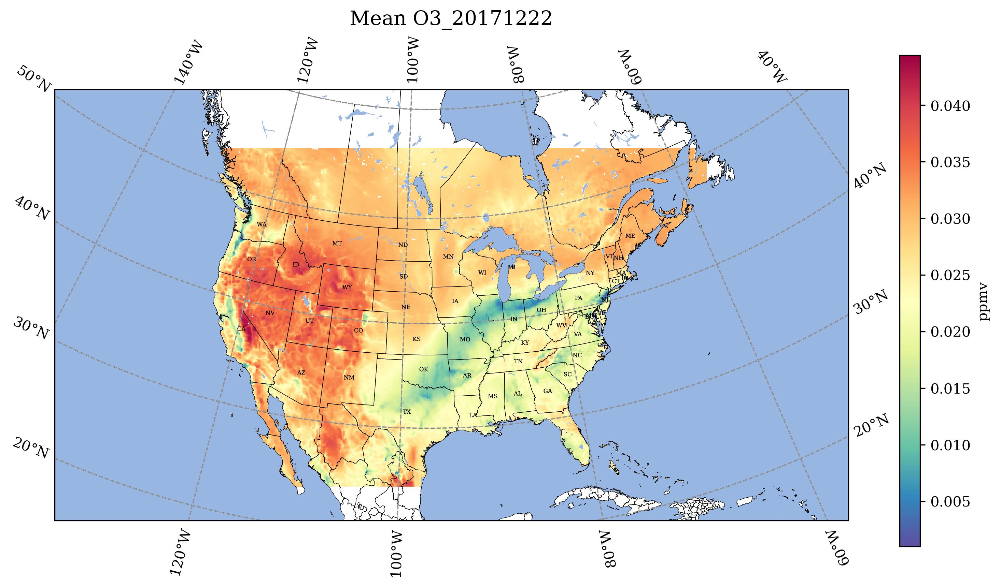
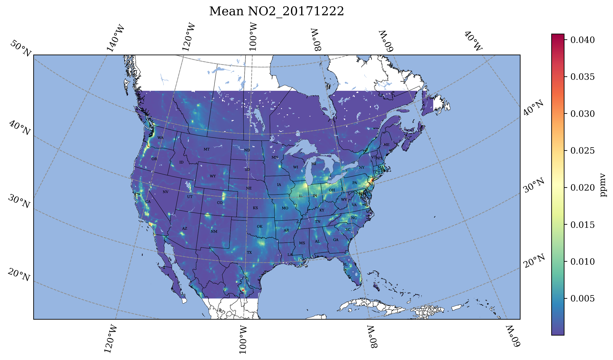
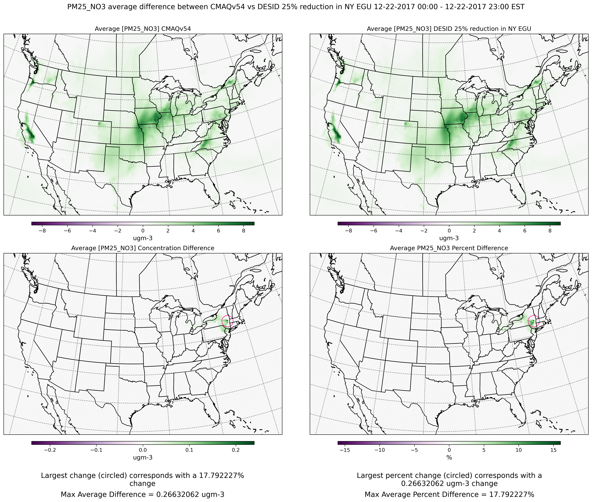

## Quality Assurance Checks for Successful CMAQ Run on CycleCloud


### run m3diff to compare the output data for two runs that have different values for NPCOL

```
cd /shared/data/output
ls */*ACONC*
```
```
setenv AFILE output_v54_cb6r5_ae7_aq_WR413_MYR_gcc_2018_12US1_3x96/CCTM_ACONC_v54_cb6r5_ae7_aq_WR413_MYR_gcc_2018_12US1_3x96_20171222.nc
setenv BFILE output_v54_cb6r5_ae7_aq_WR413_MYR_gcc_2018_12US1_4x96/CCTM_ACONC_v54_cb6r5_ae7_aq_WR413_MYR_gcc_2018_12US1_4x96_20171222.nc
```

```
m3diff
```
hit return several times to accept the default options

```
grep A:B REPORT
```

Should see all zeros. There are some non-zero values.
It appears to have all zeros if the domain decomposition  is the same NPCOL, here, NPCOL differs (10 vs 16)
Did a test to determine if removing the compiler option -march=native would result in zero differences if NPCOL differs.
This seems to work on CycleCloud, but did not work on Parallel Cluster.

Verify that you have loaded the gcc and openmpi modules.

`module avail`

`module load gcc-9.2.0`

`module load mpi/openmpi-4.1.5`

Verfiy the compiler version:

`gcc --version`

Output

```
gcc (GCC) 9.2.0
```

Evaluation of the Makefiles on Cyclecloud:

```
cd /shared/build/openmpi_gcc/CMAQ_v54/CCTM/scripts/BLD_CCTM_v54_gcc
grep FSTD Makefile
```

Output (note there is no longer the option -march=native that was causing differences in answers:

```
 FSTD = -O3 -funroll-loops -finit-character=32 -Wtabs -Wsurprising -ftree-vectorize -ftree-loop-if-convert -finline-limit=512
```

Check NPCOL NPROW for each run script

```
grep 'NPCOL  =' run_cctm_2018_12US1_v54_cb6r5_ae6.20171222.3x96.ncclassic.csh
```

```
   @ NPCOL  =  16; @ NPROW =  18
```

```
grep 'NPCOL  =' run_cctm_2018_12US1_v54_cb6r5_ae6.20171222.4x96.ncclassic.csh
```

Output

```
@ NPCOL  =  16; @ NPROW =  24

```


```
grep A:B REPORT
```

output

```
 A:B  0.00000E+00@(  1,  0, 0)  0.00000E+00@(  1,  0, 0)  0.00000E+00  0.00000E+00
 A:B  0.00000E+00@(  1,  0, 0)  0.00000E+00@(  1,  0, 0)  0.00000E+00  0.00000E+00
 A:B  0.00000E+00@(  1,  0, 0)  0.00000E+00@(  1,  0, 0)  0.00000E+00  0.00000E+00
 A:B  0.00000E+00@(  1,  0, 0)  0.00000E+00@(  1,  0, 0)  0.00000E+00  0.00000E+00
 A:B  0.00000E+00@(  1,  0, 0)  0.00000E+00@(  1,  0, 0)  0.00000E+00  0.00000E+00
 A:B  0.00000E+00@(  1,  0, 0)  0.00000E+00@(  1,  0, 0)  0.00000E+00  0.00000E+00
 A:B  0.00000E+00@(  1,  0, 0)  0.00000E+00@(  1,  0, 0)  0.00000E+00  0.00000E+00
 A:B  0.00000E+00@(  1,  0, 0)  0.00000E+00@(  1,  0, 0)  0.00000E+00  0.00000E+00
 A:B  0.00000E+00@(  1,  0, 0)  0.00000E+00@(  1,  0, 0)  0.00000E+00  0.00000E+00
 A:B  0.00000E+00@(  1,  0, 0)  0.00000E+00@(  1,  0, 0)  0.00000E+00  0.00000E+00
 A:B  0.00000E+00@(  1,  0, 0)  0.00000E+00@(  1,  0, 0)  0.00000E+00  0.00000E+00
 A:B  0.00000E+00@(  1,  0, 0)  0.00000E+00@(  1,  0, 0)  0.00000E+00  0.00000E+00
 A:B  0.00000E+00@(  1,  0, 0)  0.00000E+00@(  1,  0, 0)  0.00000E+00  0.00000E+00
 A:B  0.00000E+00@(  1,  0, 0)  0.00000E+00@(  1,  0, 0)  0.00000E+00  0.00000E+00
 A:B  0.00000E+00@(  1,  0, 0)  0.00000E+00@(  1,  0, 0)  0.00000E+00  0.00000E+00
 A:B  0.00000E+00@(  1,  0, 0)  0.00000E+00@(  1,  0, 0)  0.00000E+00  0.00000E+00
 A:B  0.00000E+00@(  1,  0, 0)  0.00000E+00@(  1,  0, 0)  0.00000E+00  0.00000E+00
 A:B  0.00000E+00@(  1,  0, 0)  0.00000E+00@(  1,  0, 0)  0.00000E+00  0.00000E+00
 A:B  0.00000E+00@(  1,  0, 0)  0.00000E+00@(  1,  0, 0)  0.00000E+00  0.00000E+00
 A:B  0.00000E+00@(  1,  0, 0)  0.00000E+00@(  1,  0, 0)  0.00000E+00  0.00000E+00
 A:B  0.00000E+00@(  1,  0, 0)  0.00000E+00@(  1,  0, 0)  0.00000E+00  0.00000E+00
 A:B  0.00000E+00@(  1,  0, 0)  0.00000E+00@(  1,  0, 0)  0.00000E+00  0.00000E+00
 A:B  0.00000E+00@(  1,  0, 0)  0.00000E+00@(  1,  0, 0)  0.00000E+00  0.00000E+00

```

### If CMAQ were compiled with -march=native, then you would see differences in the output if NPCOL was different, see previous version of this tutorial for more information

## R analysis scripts

### Run the following R script to create box plots and spatial plots showing difference between two CMAQ runs. 

Note: requires that the R scripts and packages. See earlier instructions. 

edit the R script to specify the sim1.dir, sim1.file  and sim2.dir, sim2.file to correspond to the Benchmark cases that have been run.


Then run the R scripts!

```
cd /shared/cyclecloud-cmaq/qa_scripts
Rscript compare_EQUATES_benchmark_output_CMAS_cyclecloud.r
```

Note, if you have a + symbol in the log filename, the script will fail.  Rename 5.4+ to 5.4plus to use the scripts.

View the Operating System

`cat /etc/os-release`

Output:

```
NAME="CentOS Linux"
VERSION="7 (Core)"
ID="centos"
ID_LIKE="rhel fedora"
VERSION_ID="7"
PRETTY_NAME="CentOS Linux 7 (Core)"
ANSI_COLOR="0;31"
CPE_NAME="cpe:/o:centos:centos:7"
HOME_URL="https://www.centos.org/"
BUG_REPORT_URL="https://bugs.centos.org/"

CENTOS_MANTISBT_PROJECT="CentOS-7"
CENTOS_MANTISBT_PROJECT_VERSION="7"
REDHAT_SUPPORT_PRODUCT="centos"
REDHAT_SUPPORT_PRODUCT_VERSION="7"
```

Example output plots are available for the CONUS Benchmark in the following directory

When NPCOL is fixed, we are seeing no difference in the answers.

Example comparison of 10x18 compared to 9x10 with the -march=native compiler flag removed

Box Plot for ANO3J when -march=native compiler flag is removed 




Box plot shows no difference between ACONC output for a CMAQv5.4 run using different PE configurations as long as NPCOL is fixed (this is true for all species that were plotted (AOTHRJ, CO, NH3, NO2, O3, OH, SO2), or when not using march=native in the compiler flag


Spatial plots were not created by the script, as there were not differences between the output files.

## Jupyter Notebook

### Use Jupyter Notebook to plot the daily average of O3 and NO2.

```
cd /shared/cyclecloud-cmaq/notebook
juptyer notebook
```

You will need to edit the path to the file, and the filenames.
Output:





### Use Jupyter Notebook to plot the averges, average differences difference and average percent differences

This notebook produces a panel of plots per species where the top two plots are averages and then the bottom two are average differences and average percent differences



