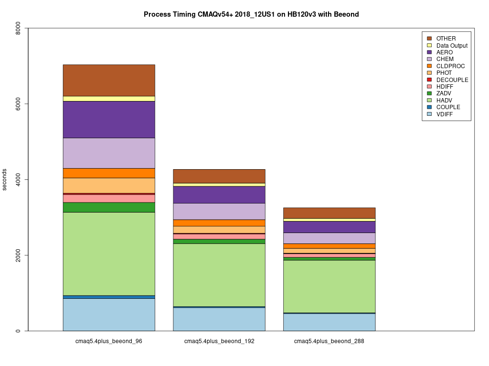

# Parse timings from the log file 

## Compare CONUS CycleCloud Runs

```{note}
CycleCloud Configurations can impact the model run times.
```
It is up the the user, as to what model run configurations are used to run CMAQ on the CycleCloud.
The following configurations may impact the run time of the model.

* For different PE configurations, using 36 cpus out of 44 cpus on HC44rs
         
         NPCOL x NPROW    
   - [ ] 6x6    #SBATCH --nodes=1, #SBATCH --ntasks-per-node=36 
   - [ ] 9x12   #SBATCH --nodes=3, #SBATCH --ntasks-per-node=36
   - [ ] 12x12   #SBATCH --nodes=4, #SBATCH --ntasks-per-node=36
   - [ ] 16x16   #SBATCH --nodes=8, #SBATCH --ntasks-per-node=36
   - [ ] 16x18   #SBATCH --nodes=8, #SBATCH --ntasks-per-node=36

* For different PE configurations, using 18 cpus out of 44 cpus on HC44rs

   - [ ] 3x6     #SBATCH --nodes=1, #SBATCH --ntasks-per-node=18
   - [ ] 9x14    #SBATCH --nodes=7, #SBATCH --ntasks-per-node=18

* For different compute nodes   

   - [ ] HC44rs  (44 cpus) - with Elastic Fabric Adapter (see above)
   - [ ] HBv120  (120 cpus -  with Elastic Fabric Adapter

* For different PE configurations, using 36 cpus out of 120 cpus on HBv120s

   - [ ] 6x6    #SBATCH --nodes=2, #SBATCH --ntasks-per-node=18
   - [ ] 6x6    #SBATCH --nodes=1, #SBATCH --ntasks-per-node=36 

* For different PE configurations, using 90 cpus out of 120 cpus on HBv120s

   - [ ] 9x10    #SBATCH --nodes=1, #SBATCH --ntasks-per-node=90
   - [ ] 10x18    #SBATCH --nodes=2, #SBATCH --ntasks-per-node=90
   - [ ] 15x18    #SBATCH --nodes=3, #SBATCH --ntasks-per-node=90
   - [ ] 20x18    #SBATCH --nodes=4, #SBATCH --ntasks-per-node=90
 

* For with and without Elastic Fabric and Elastic Netaork Adapter 

* For with and without network placement 

* For /shared versus /data

   - [ ] input data copied to /shared
   - [ ] input data  copied to /data
   - [ ] input data copied to /mnt resource (local to each node)

## Edit the R script

First check to see what log files are available:

`ls -lrt /shared/build/openmpi_gcc/CMAQ_v533/CCTM/scripts/*.log`

Modify the name of the log file to match what is avaible on your system.

`cd /shared/pcluster-cmaq/qa_scripts`

`vi parse_timing_pcluster.r`

Edit the following section of the script to specify the log file names available on your ParallelCluster

```
sens.dir  <- '/shared/build/openmpi_gcc/CMAQ_v533/CCTM/scripts/'
base.dir  <- '/shared/build/openmpi_gcc/CMAQ_v533/CCTM/scripts/'
files     <- dir(sens.dir, pattern ='run_cctmv5.3.3_Bench_2016_12US2.20x18pe.2day.sleep.cyclecloud.log' )
b.files <- dir(base.dir,pattern='run_cctmv5.3.3_Bench_2016_12US2.9x10pe.2day_remove_native_sleep.cyclecloud.log')
#Compilers <- c('intel','gcc','pgi')
Compilers <- c('gcc')
# name of the base case timing. I am using the current master branch from the CMAQ_Dev repository.
# The project directory name is used for the sensitivity case.
base.name <- '9x10pe'
sens.name <- '20x18pe'
```


### Use parse_timing.r script to examine timings of each process in CMAQ

```
cd qa_scripts
Rscript parse_timing.r
```

Timing Plot Comparing 96, 192, 288 cpus on HB120rs_v3 using Beeond Filesystem


